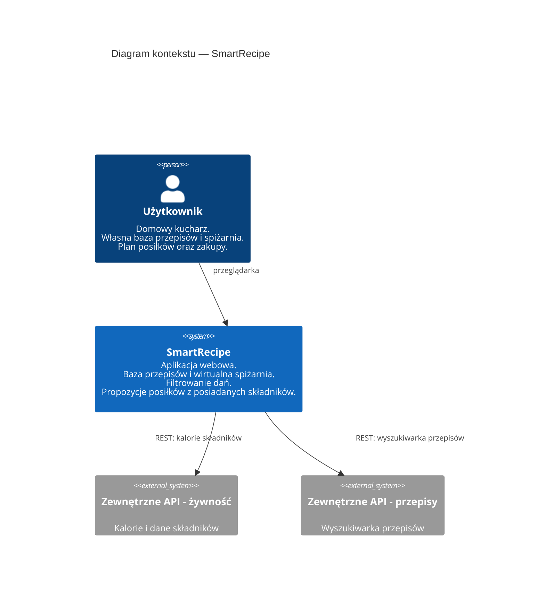
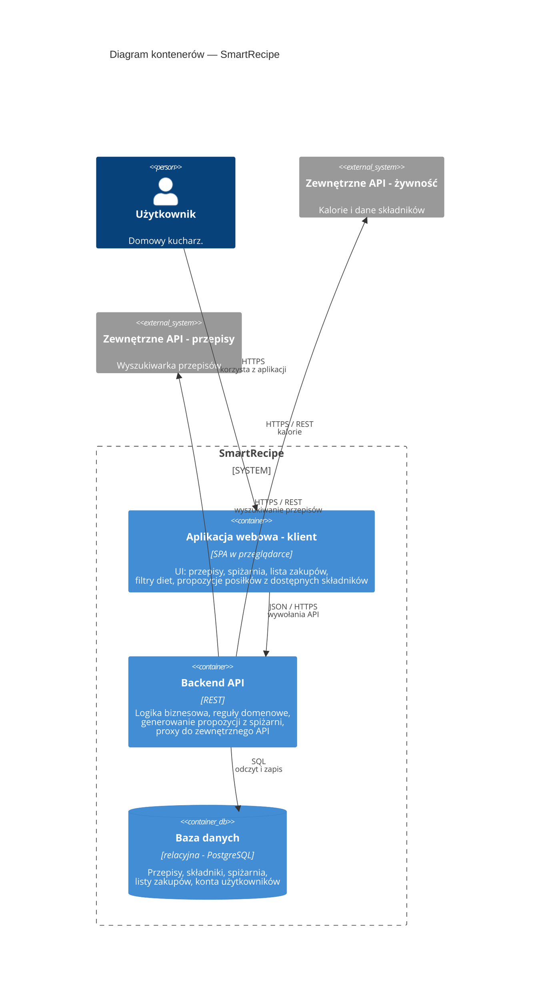

# Część 1: Wybór tematu i zrozumienie potrzeb (12.04.2026)

### Temat projektu

System do zarządzania bazą przepisów kulinarnych z inteligentnym modułem generowania posiłków na podstawie stanu wirtualnej spiżarni.

### Potrzeby klienta

Użytkownik traci zbyt dużo czasu na zastanawianie się, co ugotować z produktów, które ma w lodówce. Frustruje go wyrzucanie psującej się żywności i konieczność ręcznego przeszukiwania sieci pod kątem posiadanych składników. Potrzebuje jednego miejsca, gdzie jego zdefiniowana dieta (np. wege, keto) krzyżuje się z realnym stanem jego kuchni i planowanymi zakupami.

### Podstawowe założenia i identyfikacja modelu opisowego:

- Aplikacja umożliwia dodawanie własnych predefiniowanych przepisów wraz z przypisaną listą i ilością wymaganych składników
- System pozwala na kategoryzowanie dań według określonych filtrów (np. typ kuchni, kaloryczność, rodzaj diety)
- Aplikacja posiada zintegrowany moduł listy zakupów / wirtualnej spiżarni
- Główny algorytm biznesowy aplikacji parsuje listę posiadanych składników i automatycznie generuje propozycje potraw, które użytkownik jest w stanie
  ugotować bez konieczności wychodzenia do sklepu.

# Część 2: Wstępna analiza i ocena wymagań systemu (10.05.2026)

### Analiza "state of the art" - istniejące rozwiązania:

Wyróżniamy na rynku aplikacje takie jak SuperCook, który ma świetne wyszukiwanie wsteczne po składnikach, ale brakuje mu dobrego zarządzania własnymi bazami przepisów.

Z drugiej strony jest Paprika 3, która doskonale radzi sobie z organizacją własnej bazy przepisów, ale nie kładzie tak dużego nacisku na algorytmy doboru składników. Nasza aplikacja ma za zadanie połączyć najlepsze cechy obu tych podejść.

### Motywacja

Optymalizacja domowego budżetu, radykalne zmniejszenie marnowania żywności i przede wszystkim automatyzacja żmudnego procesu planowania codziennych posiłków, a także łatwe planowanie zakupów na bazie wybranych przepisów.

### Główny przypadek użycia

Wygenerowanie listy dopasowanych przepisów z listy tych predefiniowanych przez użytkownika na podstawie składników zaznaczonych jako dostępne na liście zakupów / w spiżarni użytkownika.

Wygenerowanie listy zakupów wypełnionej brakującymi produktami na podstawie wybranych przez użytkownika przepisów i produktów dostępnych w jego spiżarni.

### Wysokopoziomowy diagram kontekstu C4 (Level 1)

#### Dodatkowo: mniej wysokopoziomowy, diagram kontenerowy C4 (Level 2)

### Model statyczny (UML)

Diagramy klas, obiektów, pakietów, komponentów oraz stany wybranych obiektów: [model-statyczny.md](model-statyczny.md).
