# SmartRecipe - Dokumentacja projektu

> **Skład zespołu:** Jakub Kapała, Grzegorz Kotkowski

> **Link do repozytorium:** [https://github.com/magnuschase/pk-io-2026](https://github.com/magnuschase/pk-io-2026)

---

## Spis treści

1. [Opis projektu i architektura](#1-opis-projektu-i-architektura)
   - [1.1 Temat i potrzeby klienta](#11-temat-i-potrzeby-klienta)
   - [1.2 Analiza istniejących rozwiązań i motywacja](#12-analiza-istniejących-rozwiązań-i-motywacja)
   - [1.3 Diagram kontekstu C4 (Level 1)](#13-diagram-kontekstu-c4-level-1)
   - [1.4 Diagram kontenerów C4 (Level 2)](#14-diagram-kontenerów-c4-level-2)
2. [Model statyczny (UML)](#2-model-statyczny-uml)
   - [2.1 Powiązanie z modelem opisowym](#21-powiązanie-z-modelem-opisowym)
   - [2.2 Diagram klas](#22-diagram-klas)
   - [2.3 Diagram obiektów (snapshot)](#23-diagram-obiektów-snapshot)
   - [2.4 Diagram pakietów](#24-diagram-pakietów)
   - [2.5 Diagram stanu: cykl życia przepisu](#25-diagram-stanu-cykl-życia-przepisu)
   - [2.6 Diagram stanu: pozycja na liście zakupów](#26-diagram-stanu-pozycja-na-liście-zakupów)
3. [Model dynamiczny (UML)](#3-model-dynamiczny-uml)
   - [3.1 Identyfikacja aktorów](#31-identyfikacja-aktorów)
   - [3.2 Przypadki użycia](#32-przypadki-użycia)
   - [3.3 Diagramy czynności](#33-diagramy-czynności)
   - [3.4 Analiza problemu](#34-analiza-problemu)
   - [3.5 Diagramy sekwencji](#35-diagramy-sekwencji)
   - [3.6 Specyfikacja wymagań](#36-specyfikacja-wymagań)
4. [Backend API](#4-backend-api)
   - [4.1 Architektura modułów](#41-architektura-modułów)
   - [4.2 Pierwsze uruchomienie](#42-pierwsze-uruchomienie)
   - [4.3 Endpointy REST](#43-endpointy-rest)
   - [4.4 Zmienne środowiskowe](#44-zmienne-środowiskowe)
   - [4.5 Produkcja i migracje](#45-produkcja-i-migracje)
   - [4.6 Komendy npm/pnpm](#46-komendy-npmpnpm)
5. [Frontend](#5-frontend)
   - [5.1 Uruchomienie](#51-uruchomienie)
   - [5.2 Docker](#52-docker)
   - [5.3 Skrypty](#53-skrypty)
6. [Plan testów](#6-plan-testów-systemu)
   - [6.1 Cel i zakres](#61-cel-i-zakres)
   - [6.2 Strategia testów](#62-strategia-testów)
   - [6.3 Testy jednostkowe](#63-testy-jednostkowe)
   - [6.4 Testy modułowe](#64-testy-modułowe)
   - [6.5 Testy funkcjonalne](#65-testy-funkcjonalne)
   - [6.6 Testy niefunkcjonalne](#66-testy-niefunkcjonalne)
   - [6.7 Automatyzacja CI](#67-automatyzacja-ci)
   - [6.8 Mapowanie wymagań na testy](#68-mapowanie-wymagań-na-testy)
7. [Raport z wyników testów](#7-raport-z-wyników-testów)
   - [7.1 Zakres i rodzaje testów](#71-zakres-i-rodzaje-testów)
   - [7.2 Wyniki](#72-wyniki)
   - [7.3 Pokrycie kodu](#73-pokrycie-kodu)
   - [7.4 Testy przez API, wydajność i bezpieczeństwo](#74-testy-przez-api-wydajność-i-bezpieczeństwo)
   - [7.5 Automatyzacja i poprawki znalezione testami](#75-automatyzacja-i-poprawki-znalezione-testami)

---

## 1. Opis projektu i architektura

### 1.1 Temat i potrzeby klienta

**Temat projektu:** System do zarządzania bazą przepisów kulinarnych z inteligentnym modułem generowania posiłków na podstawie stanu wirtualnej spiżarni.

**Potrzeby klienta:**
Użytkownik traci zbyt dużo czasu na zastanawianie się, co ugotować z produktów, które ma w lodówce. Frustruje go wyrzucanie psującej się żywności i konieczność ręcznego przeszukiwania sieci pod kątem posiadanych składników. Potrzebuje jednego miejsca, gdzie jego zdefiniowana dieta (np. wege, keto) krzyżuje się z realnym stanem jego kuchni i planowanymi zakupami.

**Podstawowe założenia:**

- Aplikacja umożliwia dodawanie własnych predefiniowanych przepisów wraz z przypisaną listą i ilością wymaganych składników
- System pozwala na kategoryzowanie dań według określonych filtrów (np. typ kuchni, kaloryczność, rodzaj diety)
- Polskie nazwy składników są tłumaczone na angielski przez **DeepL** przed wyszukiwaniem w bazie USDA (kaloryka i waga porcji)
- Aplikacja posiada zintegrowany moduł listy zakupów / wirtualnej spiżarni
- Główny algorytm biznesowy aplikacji parsuje listę posiadanych składników i automatycznie generuje propozycje potraw, które użytkownik jest w stanie ugotować bez konieczności wychodzenia do sklepu

---

### 1.2 Analiza istniejących rozwiązań i motywacja

**Analiza "state of the art":**

Wyróżniamy na rynku aplikacje takie jak **SuperCook**, który ma świetne wyszukiwanie wsteczne po składnikach, ale brakuje mu dobrego zarządzania własnymi bazami przepisów.

Z drugiej strony jest **Paprika 3**, która doskonale radzi sobie z organizacją własnej bazy przepisów, ale nie kładzie tak dużego nacisku na algorytmy doboru składników. Nasza aplikacja ma za zadanie połączyć najlepsze cechy obu tych podejść.

**Motywacja:**
Optymalizacja domowego budżetu, radykalne zmniejszenie marnowania żywności i przede wszystkim automatyzacja żmudnego procesu planowania codziennych posiłków, a także łatwe planowanie zakupów na bazie wybranych przepisów.

**Główny przypadek użycia:**

- Wygenerowanie listy dopasowanych przepisów z listy tych predefiniowanych przez użytkownika na podstawie składników zaznaczonych jako dostępne na liście zakupów / w spiżarni użytkownika.
- Wygenerowanie listy zakupów wypełnionej brakującymi produktami na podstawie wybranych przez użytkownika przepisów i produktów dostępnych w jego spiżarni.

---

### 1.3 Diagram kontekstu C4 (Level 1)

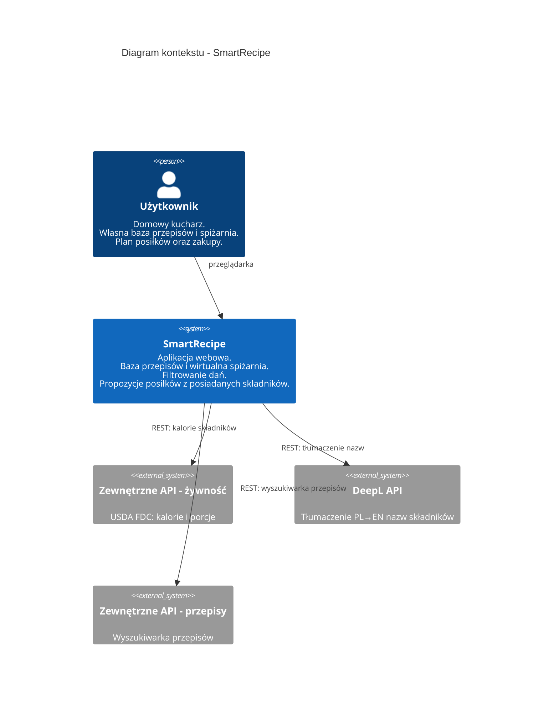

---

### 1.4 Diagram kontenerów C4 (Level 2)

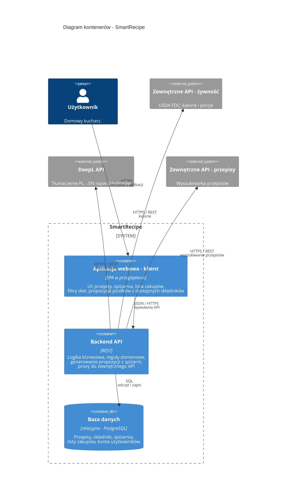

[↑ Spis treści](#spis-treści)

---

## 2. Model statyczny (UML)

### 2.1 Powiązanie z modelem opisowym

Model statyczny precyzuje strukturę danych i podział odpowiedzialności między warstwami aplikacji tak, aby realizowały założenia z dokumentacji wstępnej. Poniższa tabela wiąże **fragmenty modelu opisowego** (wymagania słowne) z **elementami modelu statycznego** (klasy, pakiety, komponenty), które pojawiają się na diagramach w kolejnych podrozdziałach.

| Fragment modelu opisowego                                  | Odwzorowanie w modelu statycznym                                                                                                                                 |
| ---------------------------------------------------------- | ---------------------------------------------------------------------------------------------------------------------------------------------------------------- |
| Własne przepisy z listą składników i ilościami             | Klasy `Recipe`, `Ingredient`, `RecipeIngredient` (ilość, jednostka); powiązania jeden do wielu między przepisem a wierszami składowymi                           |
| Filtry: typ kuchni, kaloryczność, rodzaj diety             | Atrybuty / wartości w `Recipe` (np. `servings`, szacowana kaloryczność na porcję, `DietType`, `CuisineType`); reguły filtrowania w warstwie aplikacji            |
| Wirtualna spiżarnia i lista zakupów                        | `PantryItem` (co użytkownik ma w domu), `ShoppingList` oraz `ShoppingListItem` (braki i zakupy)                                                                  |
| Integracja: kalorie składników, wyszukiwarka przepisów     | Pakiet `infrastructure`: `DeeplTranslationClient` (PL→EN nazw składników), `NutritionApiClient` (USDA FDC: kcal/100 g, `gramsPerPiece`), `RecipeSearchApiClient` |
| Tłumaczenie przed wyszukiwaniem USDA                       | `NutritionService` wywołuje DeepL, potem USDA FDC po angielskiej frazie; bez klucza DeepL - fallback na polską nazwę                                             |
| Szacowanie kcal przepisu w szkicu                          | `RecipeManagementService.estimateKcal` - suma składników (g/ml/szt z `gramsPerPiece`) ÷ `servings` → `estimatedKcalPerServing` (tylko `DRAFT`)                   |
| Generowanie propozycji posiłków z posiadanych składników   | `MealSuggestionService` w warstwie `application` - operacja `suggestRecipes` na bazie przepisów użytkownika i stanu spiżarni                                     |
| Dodawanie i edycja własnych przepisów (szkic → publikacja) | `RecipeManagementService` - tworzenie szkicu, skład, metadane, publikacja / archiwizacja / usuwanie; użytkownik operuje przez API, nie bezpośrednio na encjach   |
| Lista zakupów i uzupełnianie jej wg wybranych przepisów    | `ShoppingListService` - aktywna lista, scalanie braków ze składu wielu `Recipe`, odjęcie tego co jest w `PantryItem`, oznaczanie zakupu                          |
| Prowadzenie wirtualnej spiżarni                            | `PantryService` - dodawanie / korekta ilości / usunięcie pozycji spiżarni powiązanych ze `Ingredient`                                                            |

> **Encje domenowe** nie są modyfikowane „z UI" wprost - warstwa aplikacji (serwisy / przypadki użycia) orkiestruje walidację, trwałość i reguły (np. tylko właściciel może edytować swój przepis).

---

### 2.2 Diagram klas

**Cel:** przedstawić główne byty domenowe, powiązania liczności oraz **serwisy aplikacyjne**, które realizują przypadki użycia (propozycje posiłków, CRUD przepisów, lista zakupów w tym wypełnianie z przepisów, spiżarnia). Użytkownik korzysta z systemu przez API / UI; **trwała zmiana stanu** przechodzi przez te serwisy. Diagram celowo pomija szczegóły UI i mapowania ORM.

**Ograniczenia:** jeden agregat użytkownika na potrzeby opisu; w rzeczywistej aplikacji warto rozważyć osobny kontekst „konto / preferencje”.

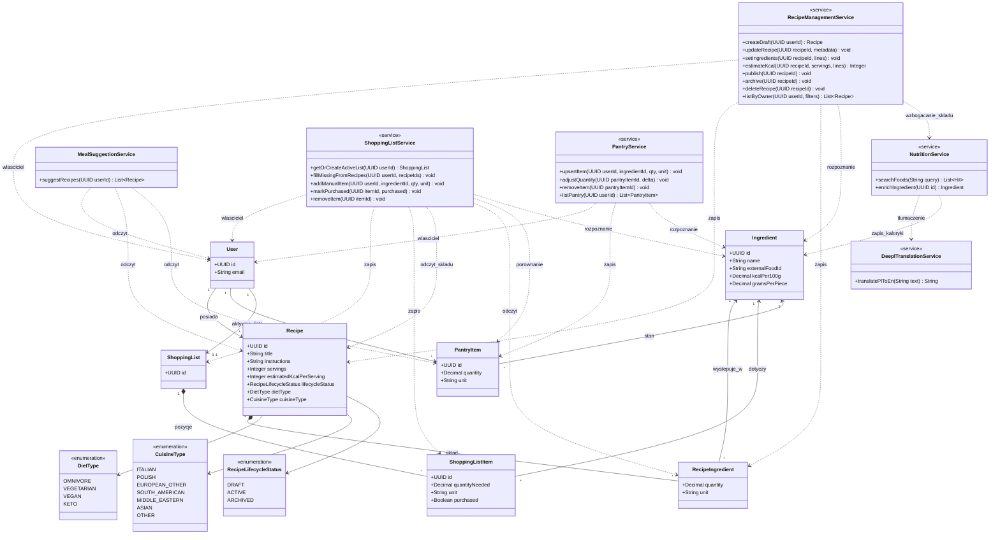

---

### 2.3 Diagram obiektów (snapshot)

**Cel:** pokazać **konkretną chwilę** w działaniu systemu - instancje i linki, a nie typy. Uzupełnia diagram klas i ułatwia sprawdzenie, czy multiplicities mają sens w przykładowym scenariuszu.

**Ograniczenia:** Mermaid nie ma pełnej notacji UML „obiektowej”; użyto klas ze stereotypem `<<object>>` oraz przykładowych wartości atrybutów.

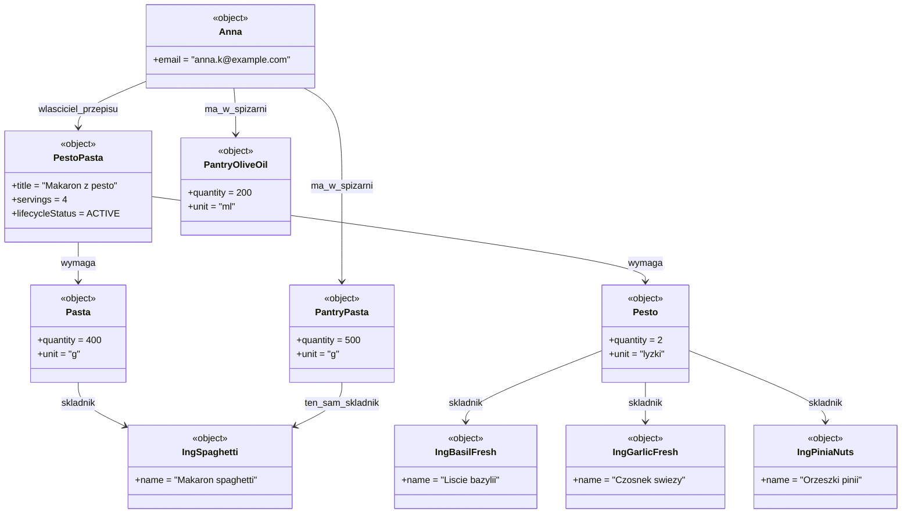

> W tej migawce Anna ma w spiżarni makaron i oliwę w ilościach wystarczających na przepis; brakujące składniki (np. bazylia, czosnek czy orzeszki pinii) mogłyby pojawić się jako obiekty `ShoppingListItem` w rozszerzonej wersji tego samego diagramu.

---

### 2.4 Diagram pakietów

**Cel:** pokazać **warstwy logiczne** zgodne z kontenerami z C4 (SPA, backend, baza), ale w ujęciu pakietów zależności - bez listy wszystkich klas.

**Ograniczenia:** zależność aplikacji od infrastruktury jest często realizowana przez wstrzykiwanie implementacji repozytoriów; na diagramie zaznaczono to jako użycie infrastruktury przez warstwę aplikacji.

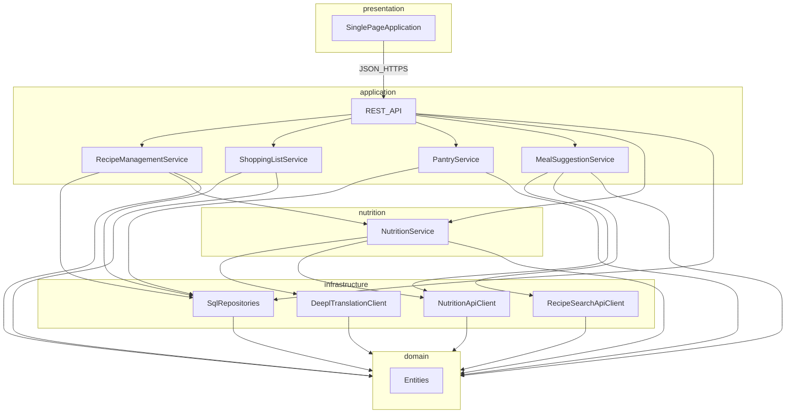

---

### 2.5 Diagram stanu: cykl życia przepisu

**Cel:** opisać stany `Recipe` istotne dla użytkownika tworzącego własną bazę - od szkicu do archiwum.

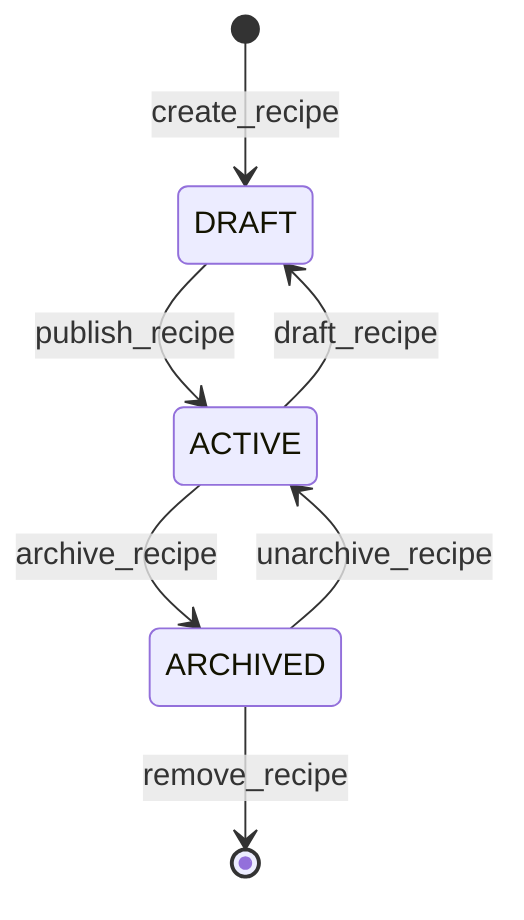

> Mapowanie na model klas: stan odpowiada atrybutowi `lifecycleStatus` (`DRAFT`, `ACTIVE`, `ARCHIVED`).

---

### 2.6 Diagram stanu: pozycja na liście zakupów

**Cel:** pokazać, jak **pozycja listy zakupów** przechodzi między stanami od zapotrzebowania do domowej spiżarni (uproszczony model; w implementacji można scalać stany z `PantryItem`).

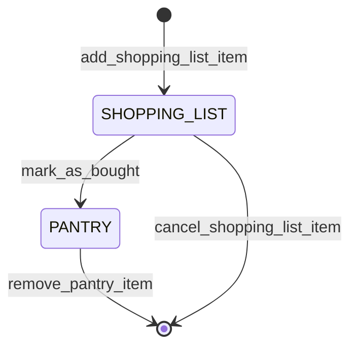

[↑ Spis treści](#spis-treści)

---

## 3. Model dynamiczny (UML)

### 3.1 Identyfikacja aktorów

| ID  | Aktor                     | Typ                 | Opis                                                                                                                                                         |
| --- | ------------------------- | ------------------- | ------------------------------------------------------------------------------------------------------------------------------------------------------------ |
| A01 | Użytkownik                | Główny, ludzki      | Domowy kucharz. Rejestruje się i loguje w systemie. Zarządza własną bazą przepisów, spiżarnią i listą zakupów. Korzysta z propozycji posiłków.               |
| A02 | Zewnętrzne API - żywność  | Drugorzędny, system | Serwis REST USDA FoodData Central - kalorie na 100 g i porcje (`gramsPerPiece`). Wywoływany po tłumaczeniu nazwy (A04).                                      |
| A03 | Zewnętrzne API - przepisy | Drugorzędny, system | Serwis REST umożliwiający wyszukiwanie przepisów spoza bazy użytkownika (np. Spoonacular). Inicjowany pośrednio przez użytkownika przez UI.                  |
| A04 | Zewnętrzne API - DeepL    | Drugorzędny, system | Serwis REST tłumaczący polskie nazwy składników na angielski przed zapytaniem do USDA FDC. Inicjowany przez system (moduł kaloryki / wzbogacania składnika). |

> Na tym etapie system nie przewiduje ról administracyjnych ani współdzielenia przepisów między użytkownikami. Każdy użytkownik operuje wyłącznie na własnych danych.

---

### 3.2 Przypadki użycia

#### Diagram przypadków użycia

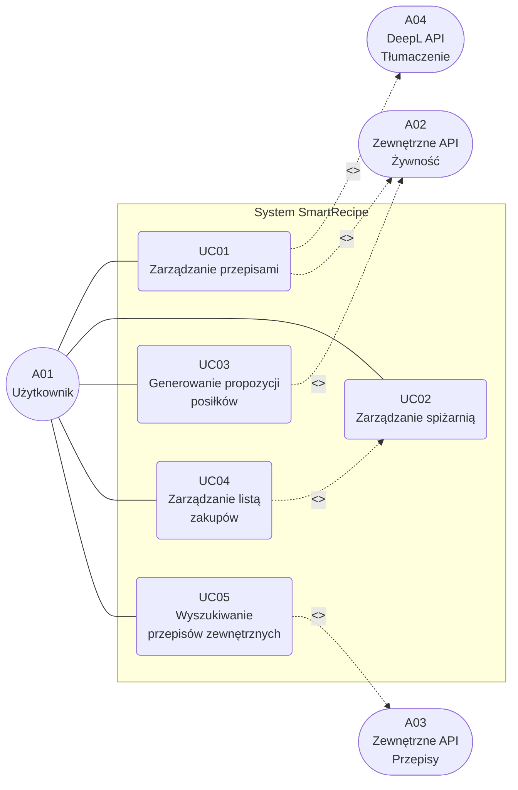

#### Lista przypadków użycia

| ID   | Nazwa                               | Aktor główny          | Priorytet |
| ---- | ----------------------------------- | --------------------- | --------- |
| UC01 | Zarządzanie przepisami              | Użytkownik (A01)      | Wysoki    |
| UC02 | Zarządzanie spiżarnią               | Użytkownik (A01)      | Wysoki    |
| UC03 | Generowanie propozycji posiłków     | Użytkownik (A01), A02 | Wysoki    |
| UC04 | Zarządzanie listą zakupów           | Użytkownik (A01)      | Wysoki    |
| UC05 | Wyszukiwanie przepisów zewnętrznych | Użytkownik (A01), A03 | Średni    |

#### UC01: Zarządzanie przepisami

| Pole                         | Opis                                                                                                                                                                                                                                                                                                                                                                                                                                                                                                                                                                                                                                                                                                                                                                                                                                                                                                                        |
| ---------------------------- | --------------------------------------------------------------------------------------------------------------------------------------------------------------------------------------------------------------------------------------------------------------------------------------------------------------------------------------------------------------------------------------------------------------------------------------------------------------------------------------------------------------------------------------------------------------------------------------------------------------------------------------------------------------------------------------------------------------------------------------------------------------------------------------------------------------------------------------------------------------------------------------------------------------------------- |
| **ID**                       | UC01                                                                                                                                                                                                                                                                                                                                                                                                                                                                                                                                                                                                                                                                                                                                                                                                                                                                                                                        |
| **Nazwa**                    | Zarządzanie przepisami                                                                                                                                                                                                                                                                                                                                                                                                                                                                                                                                                                                                                                                                                                                                                                                                                                                                                                      |
| **Aktor główny**             | Użytkownik (A01)                                                                                                                                                                                                                                                                                                                                                                                                                                                                                                                                                                                                                                                                                                                                                                                                                                                                                                            |
| **Cel**                      | Stworzenie i utrzymanie własnej bazy przepisów kulinarnych                                                                                                                                                                                                                                                                                                                                                                                                                                                                                                                                                                                                                                                                                                                                                                                                                                                                  |
| **Warunki wstępne**          | Użytkownik jest zalogowany                                                                                                                                                                                                                                                                                                                                                                                                                                                                                                                                                                                                                                                                                                                                                                                                                                                                                                  |
| **Scenariusz główny**        | 1. Użytkownik tworzy szkic przepisu (tytuł, metadane: liczba porcji, dieta, kuchnia, kaloryczność).<br/>2. Definiuje skład - składniki, ilości i jednostki.<br/>3. Publikuje przepis - status zmienia się na `ACTIVE`.<br/>4. Filtruje przepisy według diety, kuchni lub kaloryczności.<br/>5. Archiwizuje lub usuwa wybrany przepis.                                                                                                                                                                                                                                                                                                                                                                                                                                                                                                                                                                                       |
| **Scenariusze alternatywne** | 2a. Składnik nieznany → system proponuje dodanie nowego wpisu do katalogu.<br/>2b. Użytkownik pobiera kalorykę składnika - system tłumaczy nazwę PL→EN (DeepL, A04), wyszukuje w USDA (A02), zapisuje `kcalPer100g` i opcjonalnie `gramsPerPiece`.<br/>2c. W szkicu użytkownik uruchamia szacowanie kcal - system sumuje składniki z `kcalPer100g` (i `gramsPerPiece` dla `szt`), dzieli przez `servings`, uzupełnia `estimatedKcalPerServing`.<br/>2d. Składnik bez kaloryki lub bez przeliczenia na gramy (np. łyżka) - pomijany w sumie; użytkownik dostaje podsumowanie pominiętych pozycji.<br/>2e. DeepL niedostępny lub brak klucza API - wyszukiwanie USDA po oryginalnej polskiej nazwie (gorsze trafienia).<br/>3a. Skład przepisu jest pusty → system blokuje publikację z komunikatem walidacji.<br/>5a. Usuwany przepis jest powiązany z aktywną listą zakupów → system ostrzega użytkownika przed usunięciem. |
| **Warunki końcowe**          | Przepis istnieje w systemie z odpowiednim statusem cyklu życia (`DRAFT`, `ACTIVE` lub `ARCHIVED`).                                                                                                                                                                                                                                                                                                                                                                                                                                                                                                                                                                                                                                                                                                                                                                                                                          |

#### UC02: Zarządzanie spiżarnią

| Pole                         | Opis                                                                                                                                                                                                                             |
| ---------------------------- | -------------------------------------------------------------------------------------------------------------------------------------------------------------------------------------------------------------------------------- |
| **ID**                       | UC02                                                                                                                                                                                                                             |
| **Nazwa**                    | Zarządzanie spiżarnią                                                                                                                                                                                                            |
| **Aktor główny**             | Użytkownik (A01)                                                                                                                                                                                                                 |
| **Cel**                      | Utrzymanie aktualnego stanu posiadanych składników                                                                                                                                                                               |
| **Warunki wstępne**          | Użytkownik jest zalogowany                                                                                                                                                                                                       |
| **Scenariusz główny**        | 1. Użytkownik przegląda listę składników w spiżarni.<br/>2. Dodaje nową pozycję - wybiera składnik, ilość i jednostkę.<br/>3. Koryguje ilość istniejącej pozycji.<br/>4. Usuwa pozycję, gdy składnik został zużyty.              |
| **Scenariusze alternatywne** | 2a. Składnik nie istnieje w katalogu → system tworzy go lub proponuje dopasowanie do istniejącego.<br/>4a. Pozycja spiżarni jest powiązana z przepisem → usunięcie nie narusza danych przepisu, zmienia wyłącznie stan spiżarni. |
| **Warunki końcowe**          | Spiżarnia odzwierciedla aktualny, zaktualizowany stan posiadanych składników.                                                                                                                                                    |

#### UC03: Generowanie propozycji posiłków

| Pole                         | Opis                                                                                                                                                                                                                                                                                                                                                                                                                                                                                |
| ---------------------------- | ----------------------------------------------------------------------------------------------------------------------------------------------------------------------------------------------------------------------------------------------------------------------------------------------------------------------------------------------------------------------------------------------------------------------------------------------------------------------------------- |
| **ID**                       | UC03                                                                                                                                                                                                                                                                                                                                                                                                                                                                                |
| **Nazwa**                    | Generowanie propozycji posiłków                                                                                                                                                                                                                                                                                                                                                                                                                                                     |
| **Aktor główny**             | Użytkownik (A01)                                                                                                                                                                                                                                                                                                                                                                                                                                                                    |
| **Aktorzy drugorzędni**      | Zewnętrzne API - żywność (A02)                                                                                                                                                                                                                                                                                                                                                                                                                                                      |
| **Cel**                      | Automatyczne dopasowanie przepisów do składników dostępnych w spiżarni                                                                                                                                                                                                                                                                                                                                                                                                              |
| **Warunki wstępne**          | Użytkownik jest zalogowany; spiżarnia zawiera co najmniej jeden składnik; użytkownik posiada co najmniej jeden opublikowany przepis (`ACTIVE`)                                                                                                                                                                                                                                                                                                                                      |
| **Scenariusz główny**        | 1. Użytkownik wybiera opcję „Generuj propozycje".<br/>2. System pobiera stan spiżarni użytkownika (`PantryItem`).<br/>3. System pobiera wszystkie `ACTIVE` przepisy użytkownika wraz ze składem (`RecipeIngredient`).<br/>4. Dla każdego przepisu system normalizuje jednostki i sprawdza dostępność wszystkich wymaganych składników.<br/>5. System zwraca listę przepisów możliwych do przygotowania.<br/>6. Użytkownik opcjonalnie filtruje wyniki według diety lub typu kuchni. |
| **Scenariusze alternatywne** | 4a. Jednostki różnią się (np. g vs kg) → system normalizuje przed porównaniem.<br/>5a. Żaden przepis nie pasuje → system informuje o braku wyników i sugeruje uzupełnienie spiżarni.<br/>5b. Przepisy, do których brakuje ≤ 2 składników → system wyświetla je jako „prawie gotowe".                                                                                                                                                                                                |
| **Warunki końcowe**          | Użytkownik widzi listę przepisów możliwych do przygotowania wyłącznie z posiadanych składników.                                                                                                                                                                                                                                                                                                                                                                                     |

#### UC04: Zarządzanie listą zakupów

| Pole                         | Opis                                                                                                                                                                                                                                                                                                                                                                                                                                               |
| ---------------------------- | -------------------------------------------------------------------------------------------------------------------------------------------------------------------------------------------------------------------------------------------------------------------------------------------------------------------------------------------------------------------------------------------------------------------------------------------------- |
| **ID**                       | UC04                                                                                                                                                                                                                                                                                                                                                                                                                                               |
| **Nazwa**                    | Zarządzanie listą zakupów                                                                                                                                                                                                                                                                                                                                                                                                                          |
| **Aktor główny**             | Użytkownik (A01)                                                                                                                                                                                                                                                                                                                                                                                                                                   |
| **Cel**                      | Planowanie zakupów spożywczych - automatyczne lub ręczne uzupełnienie listy na podstawie wybranych przepisów i stanu spiżarni                                                                                                                                                                                                                                                                                                                      |
| **Warunki wstępne**          | Użytkownik jest zalogowany                                                                                                                                                                                                                                                                                                                                                                                                                         |
| **Scenariusz główny**        | 1. Użytkownik otwiera aktywną listę zakupów (tworzona automatycznie, jeśli nie istnieje).<br/>2. Wybiera przepisy do przygotowania.<br/>3. System oblicza brakujące składniki: skład wybranych przepisów minus stan spiżarni.<br/>4. Braki trafiają na listę jako pozycje `ShoppingListItem`.<br/>5. Użytkownik przegląda listę i opcjonalnie dodaje ręcznie dodatkowe pozycje.<br/>6. Użytkownik oznacza kupione pozycje jako `purchased = true`. |
| **Scenariusze alternatywne** | 3a. Składnik z wielu przepisów pokrywa się → ilości są sumowane w jednej pozycji.<br/>6a. Wszystkie pozycje oznaczone jako kupione → system proponuje przeniesienie ich do spiżarni.                                                                                                                                                                                                                                                               |
| **Warunki końcowe**          | Lista zakupów zawiera pozycje ze skalkulowanymi brakami; część lub wszystkie są oznaczone jako zakupione.                                                                                                                                                                                                                                                                                                                                          |

#### UC05: Wyszukiwanie przepisów zewnętrznych

| Pole                         | Opis                                                                                                                                                                                                                                     |
| ---------------------------- | ---------------------------------------------------------------------------------------------------------------------------------------------------------------------------------------------------------------------------------------- |
| **ID**                       | UC05                                                                                                                                                                                                                                     |
| **Nazwa**                    | Wyszukiwanie przepisów zewnętrznych                                                                                                                                                                                                      |
| **Aktor główny**             | Użytkownik (A01)                                                                                                                                                                                                                         |
| **Aktorzy drugorzędni**      | Zewnętrzne API - przepisy (A03)                                                                                                                                                                                                          |
| **Cel**                      | Poszerzenie własnej bazy przepisów o wyniki z zewnętrznego serwisu                                                                                                                                                                       |
| **Warunki wstępne**          | Użytkownik jest zalogowany; zewnętrzne API przepisów jest dostępne                                                                                                                                                                       |
| **Scenariusz główny**        | 1. Użytkownik wpisuje frazę wyszukiwania.<br/>2. System wysyła zapytanie do zewnętrznego API przepisów (A03).<br/>3. Wyniki są wyświetlane użytkownikowi.<br/>4. Użytkownik wybiera przepis i importuje go do własnej bazy jako `DRAFT`. |
| **Scenariusze alternatywne** | 2a. Brak odpowiedzi API (timeout / błąd) → system wyświetla komunikat o niedostępności, funkcja niedostępna.<br/>4a. Importowany przepis zawiera nieznane składniki → system tworzy dla nich nowe wpisy w katalogu składników.           |
| **Warunki końcowe**          | Wybrany przepis jest zapisany w bazie użytkownika ze statusem `DRAFT`, gotowy do edycji i publikacji.                                                                                                                                    |

---

### 3.3 Diagramy czynności

#### UC03 - Generowanie propozycji posiłków

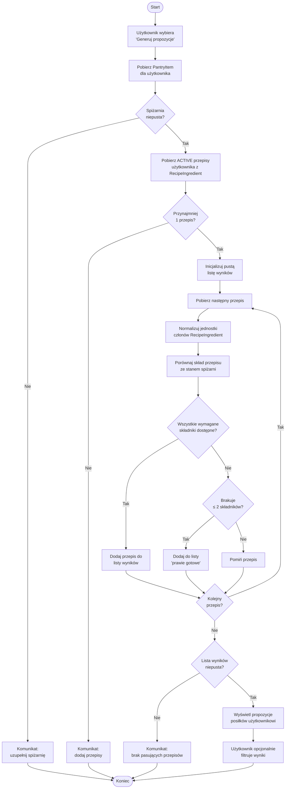

#### UC04 - Zarządzanie listą zakupów

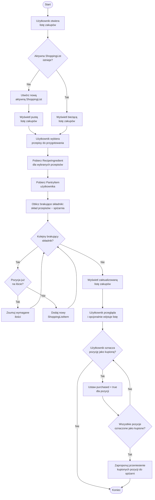

---

### 3.4 Analiza problemu

#### Weryfikacja spójności modelu

Poniższa tabela weryfikuje zgodność przypadków użycia z elementami modelu statycznego i sprawdza, czy każdy UC ma swój odpowiednik w serwisach i encjach domenowych.

| Przypadek użycia             | Kluczowe encje (model statyczny)                         | Kluczowy serwis                    | Spójność |
| ---------------------------- | -------------------------------------------------------- | ---------------------------------- | -------- |
| UC01: Zarządzanie przepisami | `Recipe`, `RecipeIngredient`, `Ingredient`               | `RecipeManagementService`          | ✓        |
| UC02: Zarządzanie spiżarnią  | `PantryItem`, `Ingredient`                               | `PantryService`                    | ✓        |
| UC03: Generowanie propozycji | `Recipe`, `PantryItem`, `RecipeIngredient`, `Ingredient` | `MealSuggestionService`            | ✓        |
| UC04: Lista zakupów          | `ShoppingList`, `ShoppingListItem`, `PantryItem`         | `ShoppingListService`              | ✓        |
| UC05: Przepisy zewnętrzne    | `Recipe`, `Ingredient`                                   | `RecipeManagementService` (import) | ✓        |

#### Analiza przyczyn problemu

**Problem centralny:** użytkownik nie wie co ugotować z posiadanych składników i w efekcie marnuje żywność lub ponosi zbędne koszty zakupów.

Główne przyczyny i sposób ich adresowania przez system:

| Przyczyna                                                                   | Adresujący element systemu                                  |
| --------------------------------------------------------------------------- | ----------------------------------------------------------- |
| Brak jednego miejsca z przepisami i stanem spiżarni                         | `Recipe` + `PantryItem` w jednej domenie; UC01 + UC02       |
| Ręczne przeszukiwanie internetu pod kątem dostępnych składników jest żmudne | `MealSuggestionService.suggestRecipes` → UC03               |
| Lista zakupów tworzona ręcznie, bez wiedzy o tym co już w domu              | `ShoppingListService.fillMissingFromRecipes` → UC04         |
| Brak filtrów diety i kuchni przy wyborze przepisów                          | Atrybuty `DietType`, `CuisineType` na `Recipe` → UC01 filtr |
| Trudność w odkryciu nowych przepisów pasujących do diety                    | Integracja z zewnętrznym API przepisów → UC05               |

#### Zidentyfikowane ryzyka i ograniczenia

| ID  | Ryzyko / ograniczenie                                                         | Wpływ  | Proponowana mitigacja                                                                                  |
| --- | ----------------------------------------------------------------------------- | ------ | ------------------------------------------------------------------------------------------------------ |
| R01 | Różnorodność jednostek miar (g, ml, łyżki, sztuki) utrudnia porównanie ilości | Wysoki | Warstwa normalizacji jednostek w `MealSuggestionService` i `ShoppingListService`                       |
| R02 | Różne nazwy tych samych składników (np. „cukier" vs „cukier biały")           | Wysoki | Normalizacja katalogu składników; pole `externalFoodId` jako kanoniczny klucz                          |
| R03 | Niedostępność zewnętrznych API (DeepL, żywność, przepisy)                     | Średni | Cache tłumaczeń i odpowiedzi USDA; bez DeepL - fallback na polską nazwę; bez USDA - brak auto-kaloryki |
| R04 | Brak mechanizmu współdzielenia przepisów między użytkownikami                 | Niski  | Poza zakresem MVP; identyfikacja dla przyszłych iteracji                                               |
| R05 | Brak uwierzytelniania i autoryzacji w opisie MVP                              | Wysoki | Wymagane wdrożenie przed wersją produkcyjną (RF14 jako wymaganie bezpieczeństwa)                       |

---

### 3.5 Diagramy sekwencji

#### UC03 - Generowanie propozycji posiłków

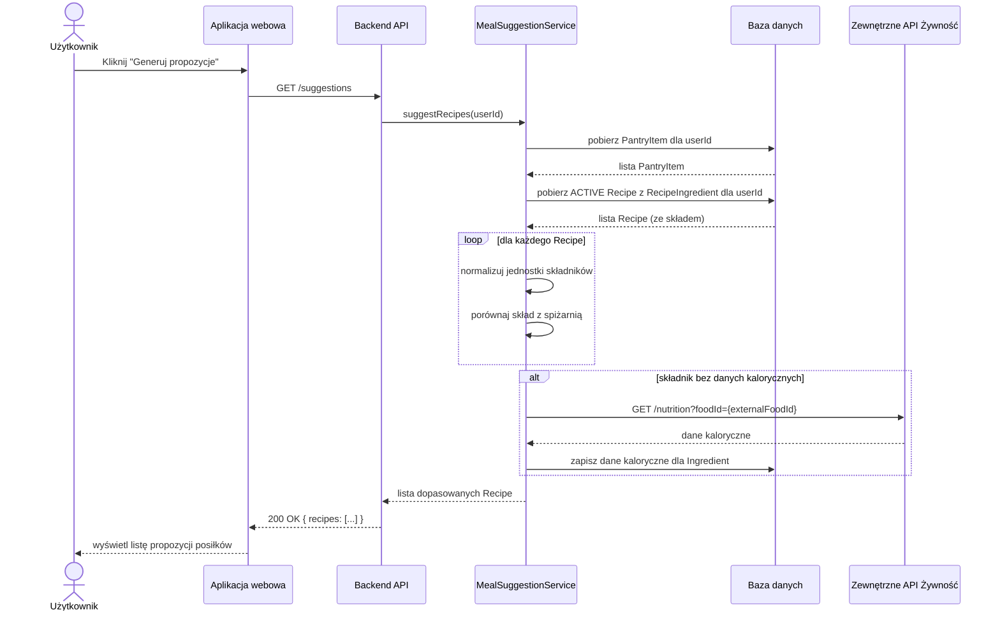

#### Wzbogacanie składnika (DeepL + USDA)

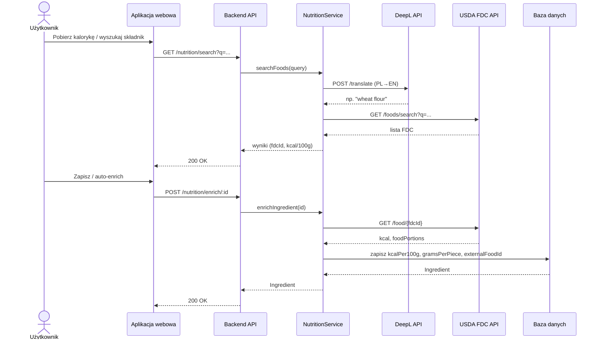

#### UC04 - Wypełnienie listy zakupów z przepisów

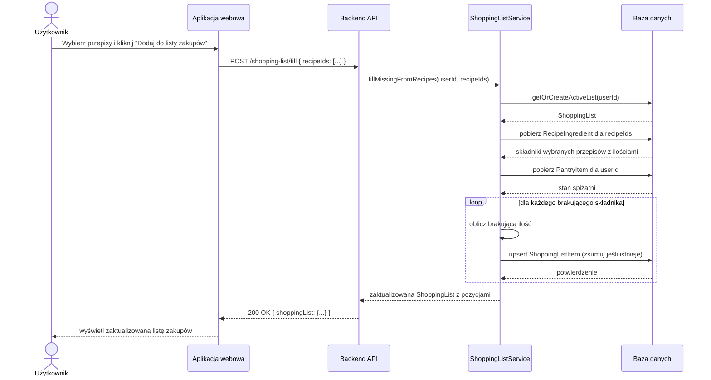

---

### 3.6 Specyfikacja wymagań

#### Wymagania funkcjonalne

| ID   | Wymaganie                                                                                                                                                     | Priorytet   | Powiązany UC |
| ---- | ------------------------------------------------------------------------------------------------------------------------------------------------------------- | ----------- | ------------ |
| RF01 | System umożliwia tworzenie, edycję, publikowanie, archiwizowanie i usuwanie przepisów                                                                         | Must-have   | UC01         |
| RF02 | Przepis zawiera: tytuł, instrukcje, listę składników z ilościami i jednostkami, liczbę porcji, typ diety, typ kuchni, szacowaną kaloryczność (kcal na porcję) | Must-have   | UC01         |
| RF03 | Przepis przechodzi przez cykl życia: `DRAFT` → `ACTIVE` ↔ `ARCHIVED`; niedozwolone przejścia są odrzucane                                                     | Must-have   | UC01         |
| RF04 | System umożliwia filtrowanie przepisów według diety, typu kuchni i zakresu kaloryczności                                                                      | Should-have | UC01         |
| RF05 | System umożliwia zarządzanie wirtualną spiżarnią (dodawanie, edycja ilości, usuwanie składników)                                                              | Must-have   | UC02         |
| RF06 | System generuje listę przepisów możliwych do przygotowania wyłącznie z dostępnych w spiżarni składników                                                       | Must-have   | UC03         |
| RF07 | Algorytm dopasowania przepisów uwzględnia normalizację jednostek miar (g/kg, ml/l, łyżki/łyżeczki)                                                            | Must-have   | UC03         |
| RF08 | System wyróżnia przepisy, do których brakuje co najwyżej 2 składników (sekcja „prawie gotowe")                                                                | Could-have  | UC03         |
| RF09 | System utrzymuje jedną aktywną listę zakupów per użytkownik, tworzoną automatycznie przy pierwszym otwarciu                                                   | Must-have   | UC04         |
| RF10 | System automatycznie oblicza brakujące składniki (skład wybranych przepisów minus stan spiżarni) i dodaje je do listy zakupów                                 | Must-have   | UC04         |
| RF11 | Pokrywające się składniki z wielu przepisów są scalane w jedną pozycję listy z sumowaną ilością                                                               | Must-have   | UC04         |
| RF12 | Użytkownik może ręcznie dodawać, edytować i usuwać pozycje z listy zakupów                                                                                    | Must-have   | UC04         |
| RF13 | Użytkownik może oznaczać pozycje listy zakupów jako zakupione (`purchased = true`)                                                                            | Must-have   | UC04         |
| RF14 | System umożliwia wyszukiwanie przepisów za pomocą zewnętrznego API i importowanie ich do bazy użytkownika jako `DRAFT`                                        | Should-have | UC05         |
| RF15 | System pobiera i cachuje dane kaloryczne składników z zewnętrznego API żywności (`kcalPer100g`, opcjonalnie `gramsPerPiece`)                                  | Should-have | UC01, UC03   |
| RF16 | W szkicu przepisu system może oszacować `estimatedKcalPerServing` na podstawie składu, liczby porcji i znormalizowanych jednostek                             | Could-have  | UC01         |
| RF17 | Przed wyszukiwaniem składnika w USDA system tłumaczy polską nazwę na angielski przez DeepL (A04); przy braku API - wyszukiwanie po nazwie polskiej            | Should-have | UC01         |

#### Wymagania niefunkcjonalne

| ID    | Wymaganie                                                                                     | Kategoria       | Miara / kryterium                                  |
| ----- | --------------------------------------------------------------------------------------------- | --------------- | -------------------------------------------------- |
| RNF01 | Czas odpowiedzi API dla generowania propozycji posiłków (UC03) < 2 s dla bazy ≤ 500 przepisów | Wydajność       | p95 < 2 s (test obciążeniowy)                      |
| RNF02 | Czas odpowiedzi pozostałych operacji CRUD < 500 ms                                            | Wydajność       | p95 < 500 ms                                       |
| RNF03 | System działa poprawnie bez dostępu do zewnętrznych API (graceful degradation)                | Niezawodność    | Dostępność core funkcji = 100% bez ext. API        |
| RNF04 | Dane użytkownika są izolowane - brak możliwości dostępu do danych innych użytkowników         | Bezpieczeństwo  | 0 naruszeń izolacji danych (test cross-user)       |
| RNF05 | Hasła użytkowników przechowywane w postaci hashu (bcrypt lub Argon2)                          | Bezpieczeństwo  | Brak plain-text haseł w bazie danych               |
| RNF06 | Interfejs webowy jest responsywny i działa poprawnie na urządzeniach mobilnych i desktopowych | Użyteczność     | Poprawne działanie na ekranach ≥ 320 px szerokości |
| RNF07 | Backend API udostępnia dokumentację zgodną ze standardem OpenAPI 3.x                          | Pielęgnowalność | Plik `openapi.yaml` aktualny z implementacją       |

#### Weryfikacja wymagań

| ID wymagania | Metoda weryfikacji                        | Kryterium akceptacji                                                                                  |
| ------------ | ----------------------------------------- | ----------------------------------------------------------------------------------------------------- |
| RF01         | Testy funkcjonalne API (CRUD)             | Wszystkie operacje zwracają poprawne kody HTTP i dane; nieistniejący zasób → 404                      |
| RF02         | Testy jednostkowe walidacji modelu        | Próba utworzenia przepisu bez wymaganych pól zwraca błąd walidacji (400)                              |
| RF03         | Testy stanów (state machine)              | Niedozwolone przejście stanu (np. `DRAFT` → `ARCHIVED`) jest odrzucane z błędem 422                   |
| RF06         | Test integracyjny z zadanym stanem danych | Dla określonego stanu spiżarni i zestawu przepisów wynik dopasowania jest deterministyczny i poprawny |
| RF07         | Testy jednostkowe modułu normalizacji     | Przeliczniki g/kg, ml/l oraz jednostki miary dają poprawne wyniki numeryczne                          |
| RF10         | Test integracyjny listy zakupów           | Różnica skład-spiżarnia jest poprawna i zdeduplikowana (scalanie pokrywających się składników)        |
| RF11         | Test integracyjny scalania pozycji        | Dodanie tych samych składników z dwóch przepisów tworzy jedną pozycję z sumą ilości                   |
| RNF01        | Test obciążeniowy (k6 / JMeter)           | p95 < 2 s przy bazie 500 przepisów i 100 równoległych użytkownikach                                   |
| RNF04        | Test bezpieczeństwa (cross-user request)  | Żądanie do zasobu innego użytkownika zwraca 403 Forbidden                                             |
| RNF05        | Inspekcja schematu bazy danych            | Kolumna hasła zawiera wyłącznie hasze (długość ≥ 60 znaków, brak rozpoznawalnych wzorców plain-text)  |

[↑ Spis treści](#spis-treści)

---

## 4. Backend API

**Stos technologiczny:** NestJS + TypeORM + PostgreSQL. Udostępnia REST API z pełną dokumentacją OpenAPI.

### 4.1 Architektura modułów

```
src/
├── auth/               # JWT register/login/refresh (UC - autoryzacja)
├── users/              # Encja User, izolacja danych per userId
├── ingredients/        # Katalog składników (shared, deduplikacja)
├── recipes/            # UC01 - CRUD przepisów, state machine DRAFT→ACTIVE↔ARCHIVED
├── pantry/             # UC02 - wirtualna spiżarnia (upsert/delete)
├── suggestions/        # UC03 - algorytm dopasowania przepisów do spiżarni
├── shopping-list/      # UC04 - lista zakupów, fillMissingFromRecipes
├── external/           # UC05 - Spoonacular search + import jako DRAFT
├── shared/             # UnitNormalizationService (g↔kg, ml↔l, łyżki↔łyżeczki)
│                       # CurrentUser dekorator
└── domain/
    ├── entities/       # TypeORM entities: User, Recipe, RecipeIngredient,
    │                   #   Ingredient, PantryItem, ShoppingList, ShoppingListItem
    └── enums.ts        # DietType, CuisineType, RecipeLifecycleStatus
```

---

### 4.2 Pierwsze uruchomienie

**Wymagania:**

- Node.js ≥ 20,
- npm ≥ 10,
- Docker + Docker Compose.

#### 1. Zmienne środowiskowe

```bash
cp .env.example .env
```

Edytuj `.env` jeśli chcesz zmienić domyślne wartości (port DB, klucze JWT). Domyślna konfiguracja działa bez zmian dla środowiska lokalnego.

#### 2. Baza danych (PostgreSQL via Docker)

```bash
# uruchom z katalogu smartrecipe/ (gdzie jest docker-compose.yml)
cd smartrecipe
docker compose up -d

# sprawdź status
docker compose ps
```

PostgreSQL nasłuchuje na porcie zdefiniowanym w `.env` (`DB_PORT`, domyślnie `5432`). Jeśli port jest zajęty, zmień `DB_PORT` w `.env`.

#### 3. Zależności i start dev

```bash
cd smartrecipe/backend
npm install
pnpm start:dev
```

Aplikacja startuje na `http://localhost:3000` (lub `PORT` z `.env`).

| URL                              | Opis                                       |
| -------------------------------- | ------------------------------------------ |
| `http://localhost:3000/api`      | Swagger UI - interaktywna dokumentacja API |
| `http://localhost:3000/api-json` | OpenAPI 3.x spec (JSON)                    |

Schemat bazy jest tworzony automatycznie przy starcie (`synchronize: true` w trybie development).

---

### 4.3 Endpointy REST

Wszystkie endpointy poza `/auth/*` wymagają nagłówka `Authorization: Bearer <accessToken>`.

#### Auth

```
POST /auth/register   { email, password }   → { accessToken, refreshToken }
POST /auth/login      { email, password }   → { accessToken, refreshToken }
POST /auth/refresh    { refreshToken }      → { accessToken, refreshToken }
```

#### Składniki

```
GET  /ingredients?search=    szukaj w katalogu
POST /ingredients            dodaj nowy składnik
```

#### Przepisy (UC01)

```
GET    /recipes                      lista (filtry: ?diet=&cuisine=&kcalMin=&kcalMax=)
POST   /recipes                      utwórz szkic (DRAFT)
GET    /recipes/:id
PATCH  /recipes/:id                  aktualizuj metadane
PUT    /recipes/:id/ingredients      ustaw skład (zastępuje poprzedni)
POST   /recipes/:id/publish          DRAFT → ACTIVE
POST   /recipes/:id/archive          ACTIVE → ARCHIVED
POST   /recipes/:id/unarchive        ARCHIVED → ACTIVE
POST   /recipes/:id/draft            ACTIVE → DRAFT
DELETE /recipes/:id
```

> Niedozwolone przejścia stanów zwracają `422 Unprocessable Entity`.

#### Spiżarnia (UC02)

```
GET    /pantry
PUT    /pantry/items/:ingredientId   { quantity, unit }
DELETE /pantry/items/:ingredientId
```

#### Propozycje posiłków (UC03)

```
GET /suggestions?diet=&cuisine=
→ { available: Recipe[], almostAvailable: { recipe, missingCount }[] }
```

Przepisy z ≤ 2 brakującymi składnikami trafiają do `almostAvailable` (RF08).

#### Lista zakupów (UC04)

```
GET    /shopping-list                           aktywna lista (auto-create)
POST   /shopping-list/fill    { recipeIds[] }   oblicz braki, dodaj do listy
POST   /shopping-list/items                     ręcznie dodaj pozycję
PATCH  /shopping-list/items/:id                 { purchased, quantityNeeded, unit }
DELETE /shopping-list/items/:id
```

#### Zewnętrzne przepisy (UC05)

```
GET  /external/recipes/search?q=&offset=  szukaj przez Spoonacular API (stronicowanie po 20)
POST /external/recipes/import        { externalId } → importuj jako DRAFT
```

Wymaga `RECIPE_API_KEY` w `.env`. Bez klucza endpoint zwraca `503`.

#### Dane odżywcze (USDA FoodData Central)

```
GET  /nutrition/search?q=&limit=          szukaj składnika w USDA FDC
POST /nutrition/enrich/:ingredientId      auto-wzbogać (pierwszy wynik USDA)
POST /nutrition/enrich/:ingredientId/fdc/:fdcId   wzbogać konkretnym FDC ID
```

Zapisuje `externalFoodId` (USDA FDC ID), `kcalPer100g` oraz `gramsPerPiece` (gdy FDC ma porcję).

Polskie nazwy składników są tłumaczone na angielski przez **DeepL** przed zapytaniem do USDA (`DEEPL_API_KEY`). Bez klucza DeepL wyszukiwanie używa oryginalnej nazwy.

> **Klucz USDA:** system automatycznie używa `DEMO_KEY` gdy `NUTRITION_API_KEY` nie jest ustawiony (limit: 30 req/godz). Klucz produkcyjny jest **bezpłatny** - rejestracja zajmuje minutę: `https://api.data.gov/signup/`. Po rejestracji ustaw `NUTRITION_API_KEY=<twój_klucz>` w `.env`.

**Przykładowy flow wzbogacania składnika:**

```bash
# 1. Znajdź FDC ID
GET /nutrition/search?q=chicken+breast
# → [{ fdcId: 2187885, description: "CHICKEN BREAST", kcalPer100g: 165 }, ...]

# 2a. Automatycznie zapisz najlepszy wynik
POST /nutrition/enrich/<ingredientId>

# 2b. Lub wybierz konkretny FDC ID ze wyszukiwania
POST /nutrition/enrich/<ingredientId>/fdc/2187885
```

---

### 4.4 Zmienne środowiskowe

| Zmienna              | Domyślnie     | Opis                                                                       |
| -------------------- | ------------- | -------------------------------------------------------------------------- |
| `DB_HOST`            | `localhost`   | Host PostgreSQL                                                            |
| `DB_PORT`            | `5432`        | Port PostgreSQL                                                            |
| `DB_NAME`            | `smartrecipe` | Nazwa bazy                                                                 |
| `DB_USER`            | `smartrecipe` | Użytkownik                                                                 |
| `DB_PASS`            | `smartrecipe` | Hasło                                                                      |
| `JWT_SECRET`         | -             | Sekret access tokenu (**zmień w produkcji**)                               |
| `JWT_REFRESH_SECRET` | -             | Sekret refresh tokenu (**zmień w produkcji**)                              |
| `JWT_ACCESS_TTL`     | `900`         | TTL access tokenu w sekundach (15 min)                                     |
| `JWT_REFRESH_TTL`    | `604800`      | TTL refresh tokenu w sekundach (7 dni)                                     |
| `NUTRITION_API_KEY`  | `DEMO_KEY`    | USDA FDC - bezpłatny klucz: api.data.gov/signup (30 req/h bez klucza)      |
| `DEEPL_API_KEY`      | -             | DeepL - tłumaczenie PL→EN nazw składników (klucz Free kończy się na `:fx`) |
| `DEEPL_API_URL`      | -             | Opcjonalny bazowy URL API DeepL (np. `https://api-free.deepl.com/v2`)      |
| `RECIPE_API_KEY`     | -             | Spoonacular - klucz do zewnętrznych przepisów (UC05, opcjonalny)           |
| `PORT`               | `3000`        | Port serwera HTTP                                                          |
| `NODE_ENV`           | `development` | `development` włącza synchronize + SQL logging                             |

---

### 4.5 Produkcja i migracje

W produkcji ustaw `NODE_ENV=production` - wyłącza automatyczną synchronizację schematu. Należy wtedy używać migracji TypeORM:

```bash
pnpm build
pnpm dlx typeorm migration:generate src/migrations/Init -d dist/data-source.js
pnpm dlx typeorm migration:run -d dist/data-source.js
pnpm start:prod
```

---

### 4.6 Komendy npm/pnpm

```bash
pnpm build        # kompilacja TypeScript → dist/
pnpm start        # start z pliku dist/ (wymaga wcześniejszego build)
pnpm start:prod   # jak wyżej, NODE_ENV=production
pnpm lint         # ESLint
pnpm test         # jednostkowe + modułowe (Jest, 135 testów)
pnpm test:e2e     # funkcjonalne API + PostgreSQL (10 testów)
pnpm test:all     # test:cov + test:e2e
```

[↑ Spis treści](#spis-treści)

---

## 5. Frontend

**Stos technologiczny:** React + Vite + TypeScript. Package manager: **pnpm** (`packageManager: pnpm@10.23.0`).

### 5.1 Uruchomienie

```bash
cd smartrecipe/frontend
cp .env.example .env
pnpm install
pnpm dev
```

- Aplikacja: `http://localhost:5173`
- Backend (domyślnie): `http://localhost:3000` - ustaw `VITE_API_URL` w `.env`

---

### 5.2 Docker

Obraz serwuje zbudowane pliki statyczne przez **nginx** (port 80, SPA fallback).

```bash
cd smartrecipe/frontend
docker build -t smartrecipe-frontend --build-arg VITE_API_URL=http://localhost:3000 .
docker run --rm -p 8080:80 smartrecipe-frontend
```

`VITE_API_URL` jest wpisywany do bundla w czasie `docker build` (zmienna Vite). W CI/CD ustaw repozytoryjne `vars.VITE_API_URL` albo przekaż `--build-arg` przy ręcznym buildzie.

Obrazy publikowane do GHCR: `ghcr.io/<org>/<repo>/smartrecipe-frontend` (workflow `frontend-docker.yml`).

---

### 5.3 Skrypty

| Polecenie         | Opis                                      |
| ----------------- | ----------------------------------------- |
| `pnpm dev`        | dev server                                |
| `pnpm build`      | produkcja                                 |
| `pnpm preview`    | podgląd buildu                            |
| `pnpm lint`       | ESLint                                    |
| `pnpm test`       | testy jednostkowe i komponentowe (Vitest) |
| `pnpm test:watch` | testy w trybie watch                      |
| `pnpm test:cov`   | testy z raportem pokrycia                 |

Testy obejmują logikę UI powiązaną z modelem domenowym (spiżarnia, przepisy i cykl życia, sugestie posiłków, lista zakupów, szacowanie kcal, filtry diety/kuchni). Raport `pnpm test:cov` mierzy warstwy `lib/`, `api/`, `hooks/`, `store/` oraz kluczowe moduły w `features/`; pełne ekrany CRUD i formularze auth są testowane ręcznie / E2E.

[↑ Spis treści](#spis-treści)

---

## 6. Plan testów systemu

### 6.1 Cel i zakres

**Cel testów** - zweryfikować, że prototyp SmartRecipe poprawnie realizuje zaplanowaną logikę biznesową: użytkownik może prowadzić własną bazę przepisów, uzupełniać wirtualną spiżarnię, otrzymywać dopasowane sugestie posiłków, generować listę zakupów oraz importować przepisy z zewnętrznej bazy.

Testy mają wychwycić regresje przed prezentacją i udokumentować pokrycie kluczowych wymagań (RF/RNF) z modelu dynamicznego.

**Zakres funkcjonalny:**

| UC   | Obszar            | Co weryfikujemy testami                                                       |
| ---- | ----------------- | ----------------------------------------------------------------------------- |
| UC01 | Przepisy          | CRUD, walidacja pól, cykl życia (szkic → aktywny → archiwum), szacowanie kcal |
| UC02 | Spiżarnia         | Dodawanie i aktualizacja składników, dopasowanie ilości                       |
| UC03 | Sugestie          | Algorytm dopasowania przepisów do zawartości spiżarni, normalizacja jednostek |
| UC04 | Lista zakupów     | Wyliczanie braków, scalanie pozycji z wielu przepisów                         |
| UC05 | Import zewnętrzny | Wyszukiwanie i import przepisu; zachowanie przy niedostępnym API              |

Poza logiką domenową sprawdzamy też **bezpieczeństwo** (izolacja danych między użytkownikami, hash haseł - RNF04, RNF05) oraz **wydajność sugestii** (RNF01 - test k6).

**Warstwy testów - 283 zautomatyzowane scenariusze:**

1. **Jednostkowe (153)** — pojedyncze funkcje i komponenty w izolacji: przeliczniki jednostek, ranking USDA, filtry przepisów i sugestii, warstwa `api/` w frontendzie.  
   Backend: 15 testów w plikach poza `*.service.spec.ts`; frontend: 138 testów (Vitest).
2. **Modułowe (120)** — współpraca serwisów NestJS z mockowaną bazą (`*.service.spec.ts`):  
   np. sugestie na podstawie spiżarni, lista zakupów z brakującymi składnikami, logowanie i szyfrowanie haseł.
3. **Funkcjonalne (10)** — pełne żądania HTTP na działającym serwerze z PostgreSQL (Supertest):  
   rejestracja, CRUD przepisów, spiżarnia → sugestie, dostęp bez tokenu, izolacja między kontami.

**Automatyzacja** — przy każdym pull requeście GitHub Actions uruchamia lint i pełny zestaw testów backendu (w tym E2E z PostgreSQL) oraz testy frontendu z kontrolą pokrycia kodu.

---

### 6.2 Strategia testów

| Warstwa                 | Narzędzie                     | Co testujemy                                       | Gdzie w repo                   |
| ----------------------- | ----------------------------- | -------------------------------------------------- | ------------------------------ |
| Jednostkowe - serwer    | Jest                          | Logika modułów: przepisy, spiżarnia, sugestie itd. | `backend/src/**/*.spec.ts`     |
| Modułowe - serwer       | Jest (z symulowaną bazą)      | Współpraca modułów bez prawdziwej bazy danych      | `*.service.spec.ts`            |
| Funkcjonalne - serwer   | Jest + Supertest + PostgreSQL | Pełne żądania HTTP: rejestracja, CRUD, sugestie    | `backend/test/*.e2e-spec.ts`   |
| Jednostkowe - interfejs | Vitest                        | Logika widoków, filtry, wywołania API              | `frontend/src/**/*.test.ts(x)` |
| Obciążeniowe            | k6                            | Czas odpowiedzi sugestii pod obciążeniem           | `smartrecipe/test/load/`       |
| Automatyzacja           | GitHub Actions                | Lint i testy przy pull requeście                   | `.github/workflows/`           |

---

### 6.3 Testy jednostkowe

#### Serwer (backend)

| Moduł               | Plik testowy                                                                                                                                                | Co weryfikuje                                           |
| ------------------- | ----------------------------------------------------------------------------------------------------------------------------------------------------------- | ------------------------------------------------------- |
| Logowanie           | `auth.service.spec.ts`                                                                                                                                      | Rejestracja, logowanie, szyfrowanie haseł               |
| Użytkownicy         | `users.service.spec.ts`                                                                                                                                     | Tworzenie konta, blokada duplikatu e-mail               |
| Przepisy            | `recipes.service.spec.ts`                                                                                                                                   | Tworzenie, edycja, usuwanie, cykl życia, właściciel     |
| Kaloryczność        | `recipe-kcal-estimator.spec.ts`                                                                                                                             | Szacowanie kcal z listy składników                      |
| Spiżarnia           | `pantry.service.spec.ts`                                                                                                                                    | Dodawanie składników, dopasowanie ilości                |
| Sugestie            | `suggestions.service.spec.ts`                                                                                                                               | Propozycje dań na podstawie spiżarni                    |
| Lista zakupów       | `shopping-list.service.spec.ts`                                                                                                                             | Braki, scalanie pozycji z wielu przepisów               |
| Składniki           | `ingredients.service.spec.ts`                                                                                                                               | Katalog składników                                      |
| Import zewnętrzny   | `external.service.spec.ts`                                                                                                                                  | Wyszukiwanie i import; zachowanie przy braku klucza API |
| Kaloryczność (USDA) | `nutrition.service.spec.ts`, `deepl-translation.service.spec.ts`, `usda-hit-ranking.spec.ts`, `usda-portion-grams.spec.ts`, `ingredient-usda-query.spec.ts` | Pobieranie danych żywieniowych, tłumaczenie nazw        |
| Jednostki miar      | `unit-normalization.service.spec.ts`                                                                                                                        | Przeliczanie gramów, mililitrów, łyżek                  |
| Aplikacja (root)    | `app.controller.spec.ts`                                                                                                                                    | Endpoint główny                                         |

**Uruchomienie:** `cd smartrecipe/backend && pnpm test`

#### Interfejs (frontend)

| Obszar                     | Co weryfikuje                                                           |
| -------------------------- | ----------------------------------------------------------------------- |
| Warstwa API (`api/`)       | Czy frontend poprawnie wysyła żądania i interpretuje odpowiedzi serwera |
| Logika pomocnicza (`lib/`) | Filtry, normalizacja składników, odświeżanie cache                      |
| Moduł przepisów            | Cykl życia, filtry, szacowanie kcal                                     |
| Moduł sugestii             | Zakładki, filtry diet i kuchni                                          |
| Moduł listy zakupów        | Uzupełnianie listy z wybranych przepisów                                |
| Hooki i store              | Logowanie, opóźnienie wyszukiwania, przewijanie list                    |

**Uruchomienie:** `cd smartrecipe/frontend && pnpm test`

> Ekrany nieobjęte automatycznym pokryciem interfejsu - formularze logowania i rejestracji oraz pełne widoki edycji przepisu testujemy ręcznie - logika pod spodem jest pokryta testami jednostkowymi interfejsu i testami serwera przez API.

---

### 6.4 Testy modułowe

Testy modułowe sprawdzają współpracę kilku elementów serwera bez uruchamiania pełnej aplikacji. Baza danych jest symulowana - test szybki i powtarzalny.

**Pliki:** `backend/src/**/*.service.spec.ts` (11 plików, 120 przypadków testowych).

Przykłady:

- moduł przepisów + moduł spiżarni → czy poprawnie liczy brakujące składniki
- moduł listy zakupów + moduł spiżarni → czy poprawnie wylicza, co trzeba dokupić
- moduł sugestii + normalizacja jednostek → czy porównuje gramy z kilogramami
- moduł kaloryczności + tłumaczenie nazw → czy wyszukuje składnik w bazie USDA po polskiej nazwie

Kryterium sukcesu: dla tego samego stanu danych wejściowych wynik jest zawsze identyczny.

---

### 6.5 Testy funkcjonalne

Wymagają działającej bazy PostgreSQL (`docker compose up -d` w folderze `smartrecipe`). Test uruchamia prawdziwy serwer i wysyła żądania HTTP.

| Plik                              | Scenariusz                                                                                            |
| --------------------------------- | ----------------------------------------------------------------------------------------------------- |
| `recipes-api.e2e-spec.ts`         | Tworzenie, odczyt, edycja i usuwanie przepisu; odrzucenie błędnych danych; przejścia między statusami |
| `pantry-suggestions.e2e-spec.ts`  | Dodanie składników do spiżarni; sprawdzenie, czy sugestie zwracają właściwy przepis                   |
| `cross-user-security.e2e-spec.ts` | Użytkownik B nie widzi danych użytkownika A; hasła zaszyfrowane w bazie                               |
| `app.e2e-spec.ts`                 | Brak dostępu do chronionych danych bez logowania                                                      |

**Uruchomienie:** `cd smartrecipe/backend && pnpm test:e2e`

---

### 6.6 Testy niefunkcjonalne

| Wymaganie                 | Co sprawdzamy                                     | Narzędzie                       | Kryterium                         |
| ------------------------- | ------------------------------------------------- | ------------------------------- | --------------------------------- |
| RNF01 - szybkość sugestii | Czas odpowiedzi przy wielu użytkownikach          | k6                              | Odpowiedź poniżej 2 s             |
| RNF04 - izolacja danych   | Użytkownik nie widzi cudzych przepisów i spiżarni | Testy przez API                 | Odmowa dostępu (kod 403)          |
| RNF05 - hasła             | Hasła nie są zapisane jako zwykły tekst           | Test przez API + inspekcja bazy | Hash bcrypt w tabeli użytkowników |

---

### 6.7 Automatyzacja CI

| Workflow          | Kiedy się uruchamia              | Co robi                                                                           |
| ----------------- | -------------------------------- | --------------------------------------------------------------------------------- |
| `backend-ci.yml`  | Zmiana w `smartrecipe/backend/`  | Sprawdza styl kodu, uruchamia testy jednostkowe z pokryciem i testy z bazą danych |
| `frontend-ci.yml` | Zmiana w `smartrecipe/frontend/` | Sprawdza styl kodu, uruchamia testy interfejsu z kontrolą minimalnego pokrycia    |

**Progi pokrycia:**

- **Interfejs:** `frontend/vitest.config.ts` - co najmniej **55%** linii (obecnie ~80%)
- **Serwer:** `backend/package.json` → `coverageThreshold` - co najmniej **45%** linii (obecnie ~67%)

---

### 6.8 Mapowanie wymagań na testy

| Wymaganie | Opis                                             | Sposób weryfikacji            | Status |
| --------- | ------------------------------------------------ | ----------------------------- | ------ |
| RF01      | CRUD przepisów                                   | Testy przez API               | OK     |
| RF02      | Walidacja pól przepisu                           | Testy przez API + jednostkowe | OK     |
| RF03      | Cykl życia przepisu (szkic / aktywny / archiwum) | Jednostkowe + przez API       | OK     |
| RF05      | Zarządzanie spiżarnią                            | Jednostkowe + przez API       | OK     |
| RF06      | Sugestie z spiżarni                              | Jednostkowe + przez API       | OK     |
| RF07      | Normalizacja jednostek (g, kg, ml…)              | Jednostkowe                   | OK     |
| RF10-RF11 | Lista zakupów, scalanie pozycji                  | Jednostkowe                   | OK     |
| RF14      | Import przepisów z zewnętrznej bazy              | Jednostkowe                   | OK     |
| RF17      | Tłumaczenie nazw przed wyszukiwaniem kalorii     | Jednostkowe                   | OK     |
| RNF01     | Szybkość sugestii                                | k6                            | OK     |
| RNF04     | Izolacja danych użytkowników                     | Testy przez API               | OK     |
| RNF05     | Szyfrowanie haseł                                | Jednostkowe + przez API       | OK     |

[↑ Spis treści](#spis-treści)

---

## 7. Raport z wyników testów

### 7.1 Zakres i rodzaje testów

Testujemy wszystkie główne funkcje SmartRecipe opisane w dokumentacji projektu: zarządzanie przepisami, spiżarnią, sugestiami posiłków, listą zakupów i importem przepisów z zewnętrznej bazy.

Dodatkowo sprawdziliśmy, czy dane jednego użytkownika nie są widoczne dla innego oraz czy sugestie ładują się wystarczająco szybko.

Zastosowaliśmy trzy wymagane poziomy testów — każdy odpowiada na inne pytanie. Dodatkowo mamy test obciążeniowy RNF01 (wymaganie projektu).

| Poziom                   | Narzędzie                         | Co sprawdza                                                                                                                | Przykład                                                           |
| ------------------------ | --------------------------------- | -------------------------------------------------------------------------------------------------------------------------- | ------------------------------------------------------------------ |
| Jednostkowe              | Jest (serwer), Vitest (interfejs) | Czy pojedyncza funkcja lub komponent działa poprawnie w izolacji                                                           | Przelicznik g→kg; filtr statusu przepisu w UI                      |
| Modułowe                 | Jest (serwer, mock bazy)          | Czy współpracujące moduły serwera dają poprawny wynik bez pełnej aplikacji                                                 | Sugestie + normalizacja jednostek; lista zakupów + spiżarnia       |
| Funkcjonalne (przez API) | Supertest + baza PostgreSQL       | Czy serwer odpowiada prawidłowo na żądania tak, jak robi to przeglądarka użytkownika — od rejestracji po pobranie sugestii | Utworzenie przepisu, dodanie go do spiżarni, odczyt listy sugestii |
| Obciążeniowe (RNF01)     | k6                                | Czy system nadąża, gdy wielu użytkowników jednocześnie prosi o sugestie                                                    | 10 użytkowników przez 30 sekund odpytuje ten sam endpoint          |

---

### 7.2 Wyniki

Wyniki zostały ponownie zweryfikowane niezależnie (Jest + Vitest + E2E). Każdy test automatyczny zakończył się powodzeniem.

| Warstwa                                | Testów  | Wynik          |
| -------------------------------------- | ------- | -------------- |
| Serwer - testy jednostkowe             | 15      | 15/15 OK       |
| Serwer - testy modułowe                | 120     | 120/120 OK     |
| Serwer - testy funkcjonalne (API + DB) | 10      | 10/10 OK       |
| Interfejs - testy jednostkowe          | 138     | 138/138 OK     |
| **Razem**                              | **283** | **283/283 OK** |

**Polecenia weryfikacyjne:**

```bash
cd smartrecipe/backend && pnpm test        # 135 testów
pnpm test:e2e                              # 10 testów
cd ../frontend && pnpm test               # 138 testów
```

W praktyce oznacza to, że po każdej większej zmianie w kodzie możemy jednym poleceniem sprawdzić setki scenariuszy — zamiast ręcznie przeklikiwać całą aplikację od nowa.

**Instrukcja uruchomienia testów:**

```bash
# Baza (wymagana dla E2E)
cd smartrecipe
docker compose up -d

# Backend: unit + coverage + E2E
cd backend
pnpm test:all

# Frontend: unit + coverage
cd ../frontend
pnpm test:cov

# Obciążeniowy RNF01 (osobny terminal: backend + k6)
winget install GrafanaLabs.k6   # Windows, jednorazowo
cd backend && pnpm start:dev
cd .. && k6 run test/load/suggestions.k6.js
```

---

### 7.3 Pokrycie kodu

| Warstwa              | Linie kodu objęte testami | Minimalny próg (ustalony przez zespół) | Status |
| -------------------- | ------------------------- | -------------------------------------- | ------ |
| Serwer (backend)     | 67,3%                     | 45%                                    | OK     |
| Interfejs (frontend) | 80,5% (linie)             | 55%                                    | OK     |

Najlepiej pokryte są moduły odpowiedzialne za logikę biznesową: przepisy, sugestie, lista zakupów, spiżarnia i kaloryczność składników.

Szczegółowe raporty HTML: `backend/coverage/lcov-report/` · `frontend/coverage/`

---

### 7.4 Testy przez API, wydajność i bezpieczeństwo

#### Testy funkcjonalne serwera (10 testów)

Testy uruchamiają działającą aplikację serwerową i wysyłają żądania tak, jak robi to frontend - z tokenem logowania. Sprawdzają m.in.:

- tworzenie, edycję i usuwanie przepisów oraz poprawność statusów (szkic → aktywny → archiwum)
- dodawanie składników do spiżarni i generowanie sugestii na tej podstawie
- to, że użytkownik A nie może podejrzeć ani zmienić przepisu użytkownika B
- to, że hasła w bazie są zapisane w formie zaszyfrowanej, a nie jako zwykły tekst
- to, że bez zalogowania nie można pobrać chronionych danych

#### Test wydajności (k6)

Narzędzie k6 symuluje 10 użytkowników, którzy przez 30 sekund proszą serwer o listę sugestii przepisów.

| Metryka                                    | Co oznacza                                        | Wynik | Limit      | Status |
| ------------------------------------------ | ------------------------------------------------- | ----- | ---------- | ------ |
| Czas odpowiedzi (najwolniejsze 5% zapytań) | Jak długo czeka „najgorzej traktowany" użytkownik | 12 ms | 2000 ms    | OK     |
| Błędy HTTP                                 | Ile zapytań zakończyło się niepowodzeniem         | 0%    | poniżej 5% | OK     |

Wynik jest znacznie lepszy niż wymagany próg. Szczegóły przebiegu: [smartrecipe/test/load/last-run-summary.md](https://github.com/magnuschase/pk-io-2026/blob/main/smartrecipe/test/load/last-run-summary.md).

---

### 7.5 Automatyzacja i poprawki znalezione testami

#### Automatyzacja

Przy każdym wysłaniu zmian do repozytorium (pull request na gałąź `main`) GitHub Actions automatycznie:

- sprawdza poprawność stylu kodu
- uruchamia wszystkie testy serwera - łącznie z testami na bazie danych
- uruchamia testy interfejsu i weryfikuje, czy pokrycie kodu nie spadło poniżej ustalonych progów

#### Poprawki znalezione dzięki testom

| Problem                                                                     | Co zrobiliśmy                                                                                                    |
| --------------------------------------------------------------------------- | ---------------------------------------------------------------------------------------------------------------- |
| Po dodaniu składników do spiżarni lista sugestii nie aktualizowała się sama | Naprawiliśmy mechanizm odświeżania danych - użytkownik widzi aktualne sugestie bez ręcznego przeładowania strony |
| Aplikacja mogła się zawiesić, gdy serwer zwrócił nieoczekiwaną odpowiedź    | Dodaliśmy sprawdzenie, czy odpowiedź jest listą - zamiast pustego ekranu pojawia się czytelny błąd               |
| Brakowało testów dla spiżarni, katalogu składników, użytkowników i importu  | Dopisaliśmy brakujące testy jednostkowe                                                                          |
| Testy serwera z bazą danych nie były w automatycznej kontroli na GitHubie   | Rozszerzyliśmy pipeline o bazę PostgreSQL i pełny zestaw testów                                                  |

[↑ Spis treści](#spis-treści)
