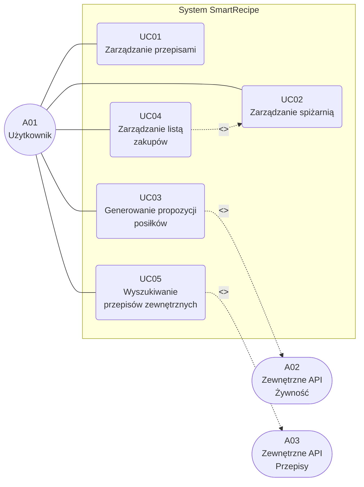
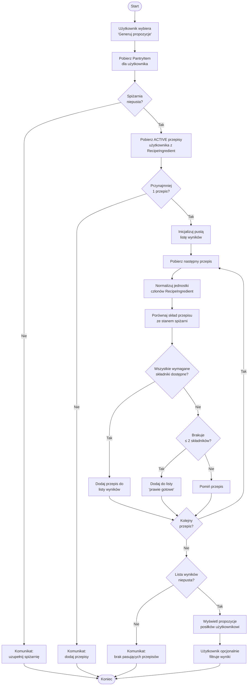
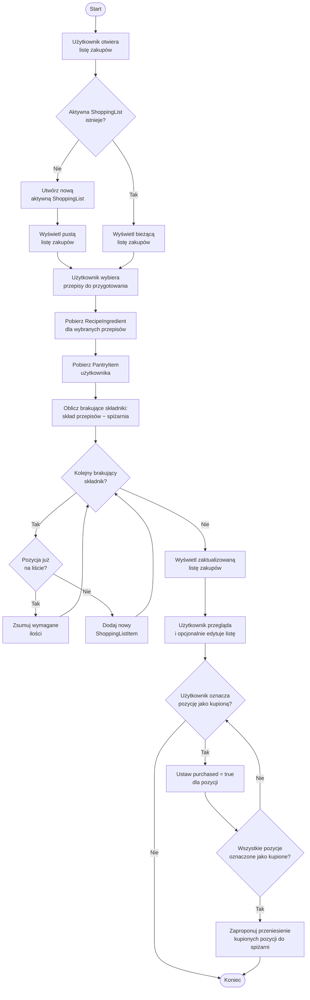
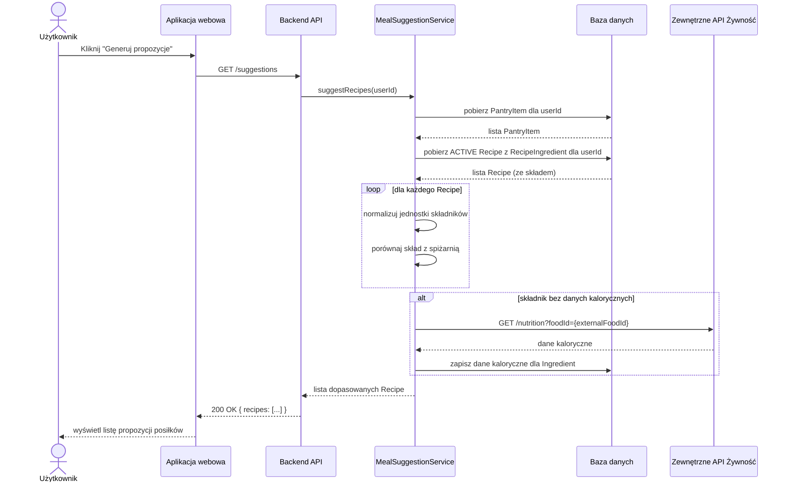
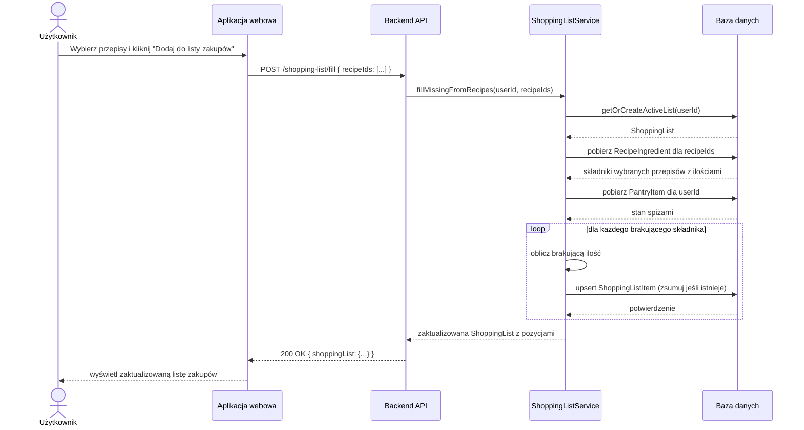

# Identyfikacja przypadków użycia, analiza problemu i specyfikacja wymagań — SmartRecipe

Dokument uzupełnia [model opisowy i diagramy C4](README.md) oraz [model statyczny](model-statyczny.md) o identyfikację aktorów i przypadków użycia, analizę problemu, modele interakcji oraz weryfikowalną specyfikację wymagań.

---

## 1. Identyfikacja aktorów

| ID  | Aktor                     | Typ                 | Opis                                                                                                                                                        |
| --- | ------------------------- | ------------------- | ----------------------------------------------------------------------------------------------------------------------------------------------------------- |
| A01 | Użytkownik                | Główny, ludzki      | Domowy kucharz. Rejestruje się i loguje w systemie. Zarządza własną bazą przepisów, spiżarnią i listą zakupów. Korzysta z propozycji posiłków.              |
| A02 | Zewnętrzne API – żywność  | Drugorzędny, system | Serwis REST dostarczający dane kaloryczne i odżywcze dla składników (np. USDA FoodData Central). Inicjowany przez system przy wzbogacaniu danych składnika. |
| A03 | Zewnętrzne API – przepisy | Drugorzędny, system | Serwis REST umożliwiający wyszukiwanie przepisów spoza bazy użytkownika (np. Spoonacular). Inicjowany pośrednio przez użytkownika przez UI.                 |

> Na tym etapie system nie przewiduje ról administracyjnych ani współdzielenia przepisów między użytkownikami. Każdy użytkownik operuje wyłącznie na własnych danych.

---

## 2. Przypadki użycia

### 2.1 Diagram przypadków użycia

### 2.2 Lista przypadków użycia

| ID   | Nazwa                               | Aktor główny          | Priorytet |
| ---- | ----------------------------------- | --------------------- | --------- |
| UC01 | Zarządzanie przepisami              | Użytkownik (A01)      | Wysoki    |
| UC02 | Zarządzanie spiżarnią               | Użytkownik (A01)      | Wysoki    |
| UC03 | Generowanie propozycji posiłków     | Użytkownik (A01), A02 | Wysoki    |
| UC04 | Zarządzanie listą zakupów           | Użytkownik (A01)      | Wysoki    |
| UC05 | Wyszukiwanie przepisów zewnętrznych | Użytkownik (A01), A03 | Średni    |

### 2.3 Specyfikacja przypadków użycia

#### UC01: Zarządzanie przepisami

| Pole                         | Opis                                                                                                                                                                                                                                                                                                                                                                                                                                                                                                                                                                                                                                                                       |
| ---------------------------- | -------------------------------------------------------------------------------------------------------------------------------------------------------------------------------------------------------------------------------------------------------------------------------------------------------------------------------------------------------------------------------------------------------------------------------------------------------------------------------------------------------------------------------------------------------------------------------------------------------------------------------------------------------------------------- |
| **ID**                       | UC01                                                                                                                                                                                                                                                                                                                                                                                                                                                                                                                                                                                                                                                                       |
| **Nazwa**                    | Zarządzanie przepisami                                                                                                                                                                                                                                                                                                                                                                                                                                                                                                                                                                                                                                                     |
| **Aktor główny**             | Użytkownik (A01)                                                                                                                                                                                                                                                                                                                                                                                                                                                                                                                                                                                                                                                           |
| **Cel**                      | Stworzenie i utrzymanie własnej bazy przepisów kulinarnych                                                                                                                                                                                                                                                                                                                                                                                                                                                                                                                                                                                                                 |
| **Warunki wstępne**          | Użytkownik jest zalogowany                                                                                                                                                                                                                                                                                                                                                                                                                                                                                                                                                                                                                                                 |
| **Scenariusz główny**        | 1. Użytkownik tworzy szkic przepisu (tytuł, metadane: liczba porcji, dieta, kuchnia, kaloryczność). 2. Definiuje skład – składniki, ilości i jednostki. 3. Publikuje przepis – status zmienia się na `ACTIVE`. 4. Filtruje przepisy według diety, kuchni lub kaloryczności. 5. Archiwizuje lub usuwa wybrany przepis.                                                                                                                                                                                                                                                                                                                                      |
| **Scenariusze alternatywne** | 2a. Składnik nieznany -> system proponuje dodanie nowego wpisu do katalogu. 2b. W szkicu użytkownik uruchamia szacowanie kcal — system sumuje składniki z `kcalPer100g` (i `gramsPerPiece` dla `szt`), dzieli przez `servings`, uzupełnia `estimatedKcalPerServing` (wartość do zapisania przez użytkownika). 2c. Składnik bez kaloryki lub bez przeliczenia na gramy (np. łyżka) — pomijany w sumie; użytkownik dostaje podsumowanie pominiętych pozycji. 3a. Skład przepisu jest pusty -> system blokuje publikację z komunikatem walidacji. 5a. Usuwany przepis jest powiązany z aktywną listą zakupów -> system ostrzega użytkownika przed usunięciem. |
| **Warunki końcowe**          | Przepis istnieje w systemie z odpowiednim statusem cyklu życia (`DRAFT`, `ACTIVE` lub `ARCHIVED`).                                                                                                                                                                                                                                                                                                                                                                                                                                                                                                                                                                         |

#### UC02: Zarządzanie spiżarnią

| Pole                         | Opis                                                                                                                                                                                                                               |
| ---------------------------- | ---------------------------------------------------------------------------------------------------------------------------------------------------------------------------------------------------------------------------------- |
| **ID**                       | UC02                                                                                                                                                                                                                               |
| **Nazwa**                    | Zarządzanie spiżarnią                                                                                                                                                                                                              |
| **Aktor główny**             | Użytkownik (A01)                                                                                                                                                                                                                   |
| **Cel**                      | Utrzymanie aktualnego stanu posiadanych składników                                                                                                                                                                                 |
| **Warunki wstępne**          | Użytkownik jest zalogowany                                                                                                                                                                                                         |
| **Scenariusz główny**        | 1. Użytkownik przegląda listę składników w spiżarni. 2. Dodaje nową pozycję – wybiera składnik, ilość i jednostkę. 3. Koryguje ilość istniejącej pozycji. 4. Usuwa pozycję, gdy składnik został zużyty.                |
| **Scenariusze alternatywne** | 2a. Składnik nie istnieje w katalogu -> system tworzy go lub proponuje dopasowanie do istniejącego. 4a. Pozycja spiżarni jest powiązana z przepisem -> usunięcie nie narusza danych przepisu, zmienia wyłącznie stan spiżarni. |
| **Warunki końcowe**          | Spiżarnia odzwierciedla aktualny, zaktualizowany stan posiadanych składników.                                                                                                                                                      |

#### UC03: Generowanie propozycji posiłków

| Pole                         | Opis                                                                                                                                                                                                                                                                                                                                                                                                                                                                                |
| ---------------------------- | ----------------------------------------------------------------------------------------------------------------------------------------------------------------------------------------------------------------------------------------------------------------------------------------------------------------------------------------------------------------------------------------------------------------------------------------------------------------------------------- |
| **ID**                       | UC03                                                                                                                                                                                                                                                                                                                                                                                                                                                                                |
| **Nazwa**                    | Generowanie propozycji posiłków                                                                                                                                                                                                                                                                                                                                                                                                                                                     |
| **Aktor główny**             | Użytkownik (A01)                                                                                                                                                                                                                                                                                                                                                                                                                                                                    |
| **Aktorzy drugorzędni**      | Zewnętrzne API – żywność (A02)                                                                                                                                                                                                                                                                                                                                                                                                                                                      |
| **Cel**                      | Automatyczne dopasowanie przepisów do składników dostępnych w spiżarni                                                                                                                                                                                                                                                                                                                                                                                                              |
| **Warunki wstępne**          | Użytkownik jest zalogowany; spiżarnia zawiera co najmniej jeden składnik; użytkownik posiada co najmniej jeden opublikowany przepis (`ACTIVE`)                                                                                                                                                                                                                                                                                                                              |
| **Scenariusz główny**        | 1. Użytkownik wybiera opcję „Generuj propozycje". 2. System pobiera stan spiżarni użytkownika (`PantryItem`). 3. System pobiera wszystkie `ACTIVE` przepisy użytkownika wraz ze składem (`RecipeIngredient`). 4. Dla każdego przepisu system normalizuje jednostki i sprawdza dostępność wszystkich wymaganych składników. 5. System zwraca listę przepisów możliwych do przygotowania. 6. Użytkownik opcjonalnie filtruje wyniki według diety lub typu kuchni. |
| **Scenariusze alternatywne** | 4a. Jednostki różnią się (np. g vs kg) -> system normalizuje przed porównaniem. 5a. Żaden przepis nie pasuje -> system informuje o braku wyników i sugeruje uzupełnienie spiżarni. 5b. Przepisy, do których brakuje ≤ 2 składników -> system wyświetla je jako „prawie gotowe".                                                                                                                                                                                             |
| **Warunki końcowe**          | Użytkownik widzi listę przepisów możliwych do przygotowania wyłącznie z posiadanych składników.                                                                                                                                                                                                                                                                                                                                                                                     |

#### UC04: Zarządzanie listą zakupów

| Pole                         | Opis                                                                                                                                                                                                                                                                                                                                                                                                                                               |
| ---------------------------- | -------------------------------------------------------------------------------------------------------------------------------------------------------------------------------------------------------------------------------------------------------------------------------------------------------------------------------------------------------------------------------------------------------------------------------------------------- |
| **ID**                       | UC04                                                                                                                                                                                                                                                                                                                                                                                                                                               |
| **Nazwa**                    | Zarządzanie listą zakupów                                                                                                                                                                                                                                                                                                                                                                                                                          |
| **Aktor główny**             | Użytkownik (A01)                                                                                                                                                                                                                                                                                                                                                                                                                                   |
| **Cel**                      | Planowanie zakupów spożywczych – automatyczne lub ręczne uzupełnienie listy na podstawie wybranych przepisów i stanu spiżarni                                                                                                                                                                                                                                                                                                                      |
| **Warunki wstępne**          | Użytkownik jest zalogowany                                                                                                                                                                                                                                                                                                                                                                                                                         |
| **Scenariusz główny**        | 1. Użytkownik otwiera aktywną listę zakupów (tworzona automatycznie, jeśli nie istnieje). 2. Wybiera przepisy do przygotowania. 3. System oblicza brakujące składniki: skład wybranych przepisów minus stan spiżarni. 4. Braki trafiają na listę jako pozycje `ShoppingListItem`. 5. Użytkownik przegląda listę i opcjonalnie dodaje ręcznie dodatkowe pozycje. 6. Użytkownik oznacza kupione pozycje jako `purchased = true`. |
| **Scenariusze alternatywne** | 3a. Składnik z wielu przepisów pokrywa się -> ilości są sumowane w jednej pozycji. 6a. Wszystkie pozycje oznaczone jako kupione -> system proponuje przeniesienie ich do spiżarni.                                                                                                                                                                                                                                                             |
| **Warunki końcowe**          | Lista zakupów zawiera pozycje ze skalkulowanymi brakami; część lub wszystkie są oznaczone jako zakupione.                                                                                                                                                                                                                                                                                                                                          |

#### UC05: Wyszukiwanie przepisów zewnętrznych

| Pole                         | Opis                                                                                                                                                                                                                                     |
| ---------------------------- | ---------------------------------------------------------------------------------------------------------------------------------------------------------------------------------------------------------------------------------------- |
| **ID**                       | UC05                                                                                                                                                                                                                                     |
| **Nazwa**                    | Wyszukiwanie przepisów zewnętrznych                                                                                                                                                                                                      |
| **Aktor główny**             | Użytkownik (A01)                                                                                                                                                                                                                         |
| **Aktorzy drugorzędni**      | Zewnętrzne API – przepisy (A03)                                                                                                                                                                                                          |
| **Cel**                      | Poszerzenie własnej bazy przepisów o wyniki z zewnętrznego serwisu                                                                                                                                                                       |
| **Warunki wstępne**          | Użytkownik jest zalogowany; zewnętrzne API przepisów jest dostępne                                                                                                                                                                   |
| **Scenariusz główny**        | 1. Użytkownik wpisuje frazę wyszukiwania. 2. System wysyła zapytanie do zewnętrznego API przepisów (A03). 3. Wyniki są wyświetlane użytkownikowi. 4. Użytkownik wybiera przepis i importuje go do własnej bazy jako `DRAFT`. |
| **Scenariusze alternatywne** | 2a. Brak odpowiedzi API (timeout / błąd) -> system wyświetla komunikat o niedostępności, funkcja niedostępna. 4a. Importowany przepis zawiera nieznane składniki -> system tworzy dla nich nowe wpisy w katalogu składników.         |
| **Warunki końcowe**          | Wybrany przepis jest zapisany w bazie użytkownika ze statusem `DRAFT`, gotowy do edycji i publikacji.                                                                                                                                    |

---

## 3. Diagramy czynności (wybranych UC)

### 3.1 Diagram czynności: UC03 – Generowanie propozycji posiłków

### 3.2 Diagram czynności: UC04 – Zarządzanie listą zakupów

---

## 4. Analiza problemu

### 4.1 Weryfikacja spójności modelu

Poniższa tabela weryfikuje zgodność przypadków użycia z elementami modelu statycznego i sprawdza, czy każdy UC ma swój odpowiednik w serwisach i encjach domenowych.

| Przypadek użycia             | Kluczowe encje (model statyczny)                         | Kluczowy serwis                    | Spójność |
| ---------------------------- | -------------------------------------------------------- | ---------------------------------- | -------- |
| UC01: Zarządzanie przepisami | `Recipe`, `RecipeIngredient`, `Ingredient`               | `RecipeManagementService`          | ✓        |
| UC02: Zarządzanie spiżarnią  | `PantryItem`, `Ingredient`                               | `PantryService`                    | ✓        |
| UC03: Generowanie propozycji | `Recipe`, `PantryItem`, `RecipeIngredient`, `Ingredient` | `MealSuggestionService`            | ✓        |
| UC04: Lista zakupów          | `ShoppingList`, `ShoppingListItem`, `PantryItem`         | `ShoppingListService`              | ✓        |
| UC05: Przepisy zewnętrzne    | `Recipe`, `Ingredient`                                   | `RecipeManagementService` (import) | ✓        |

### 4.2 Analiza przyczyn problemu

**Problem centralny:** użytkownik nie wie co ugotować z posiadanych składników i w efekcie marnuje żywność lub ponosi zbędne koszty zakupów.

Główne przyczyny i sposób ich adresowania przez system:

| Przyczyna                                                                   | Adresujący element systemu                                   |
| --------------------------------------------------------------------------- | ------------------------------------------------------------ |
| Brak jednego miejsca z przepisami i stanem spiżarni                         | `Recipe` + `PantryItem` w jednej domenie; UC01 + UC02        |
| Ręczne przeszukiwanie internetu pod kątem dostępnych składników jest żmudne | `MealSuggestionService.suggestRecipes` -> UC03               |
| Lista zakupów tworzona ręcznie, bez wiedzy o tym co już w domu              | `ShoppingListService.fillMissingFromRecipes` -> UC04         |
| Brak filtrów diety i kuchni przy wyborze przepisów                          | Atrybuty `DietType`, `CuisineType` na `Recipe` -> UC01 filtr |
| Trudność w odkryciu nowych przepisów pasujących do diety                    | Integracja z zewnętrznym API przepisów -> UC05               |

### 4.3 Zidentyfikowane ryzyka i ograniczenia

| ID  | Ryzyko / ograniczenie                                                         | Wpływ  | Proponowana mitigacja                                                            |
| --- | ----------------------------------------------------------------------------- | ------ | -------------------------------------------------------------------------------- |
| R01 | Różnorodność jednostek miar (g, ml, łyżki, sztuki) utrudnia porównanie ilości | Wysoki | Warstwa normalizacji jednostek w `MealSuggestionService` i `ShoppingListService` |
| R02 | Różne nazwy tych samych składników (np. „cukier" vs „cukier biały")           | Wysoki | Normalizacja katalogu składników; pole `externalFoodId` jako kanoniczny klucz    |
| R03 | Niedostępność zewnętrznych API (żywność, przepisy)                            | Średni | Cache odpowiedzi API; graceful degradation – system działa bez zewnętrznych API  |
| R04 | Brak mechanizmu współdzielenia przepisów między użytkownikami                 | Niski  | Poza zakresem MVP; identyfikacja dla przyszłych iteracji                         |
| R05 | Brak uwierzytelniania i autoryzacji w opisie MVP                              | Wysoki | Wymagane wdrożenie przed wersją produkcyjną (RF14 jako wymaganie bezpieczeństwa) |

---

## 5. Modele interakcji (diagramy sekwencji)

### 5.1 Diagram sekwencji: UC03 – Generowanie propozycji posiłków

### 5.2 Diagram sekwencji: UC04 – Wypełnienie listy zakupów z przepisów

---

## 6. Specyfikacja wymagań

### 6.1 Wymagania funkcjonalne

| ID   | Wymaganie                                                                                                                                                     | Priorytet   | Powiązany UC |
| ---- | ------------------------------------------------------------------------------------------------------------------------------------------------------------- | ----------- | ------------ |
| RF01 | System umożliwia tworzenie, edycję, publikowanie, archiwizowanie i usuwanie przepisów                                                                         | Must-have   | UC01         |
| RF02 | Przepis zawiera: tytuł, instrukcje, listę składników z ilościami i jednostkami, liczbę porcji, typ diety, typ kuchni, szacowaną kaloryczność (kcal na porcję) | Must-have   | UC01         |
| RF03 | Przepis przechodzi przez cykl życia: `DRAFT` -> `ACTIVE` ↔ `ARCHIVED`; niedozwolone przejścia są odrzucane                                                    | Must-have   | UC01         |
| RF04 | System umożliwia filtrowanie przepisów według diety, typu kuchni i zakresu kaloryczności                                                                      | Should-have | UC01         |
| RF05 | System umożliwia zarządzanie wirtualną spiżarnią (dodawanie, edycja ilości, usuwanie składników)                                                              | Must-have   | UC02         |
| RF06 | System generuje listę przepisów możliwych do przygotowania wyłącznie z dostępnych w spiżarni składników                                                       | Must-have   | UC03         |
| RF07 | Algorytm dopasowania przepisów uwzględnia normalizację jednostek miar (g/kg, ml/l, łyżki/łyżeczki)                                                            | Must-have   | UC03         |
| RF08 | System wyróżnia przepisy, do których brakuje co najwyżej 2 składników (sekcja „prawie gotowe")                                                                | Could-have  | UC03         |
| RF09 | System utrzymuje jedną aktywną listę zakupów per użytkownik, tworzoną automatycznie przy pierwszym otwarciu                                                   | Must-have   | UC04         |
| RF10 | System automatycznie oblicza brakujące składniki (skład wybranych przepisów minus stan spiżarni) i dodaje je do listy zakupów                                 | Must-have   | UC04         |
| RF11 | Pokrywające się składniki z wielu przepisów są scalane w jedną pozycję listy z sumowaną ilością                                                               | Must-have   | UC04         |
| RF12 | Użytkownik może ręcznie dodawać, edytować i usuwać pozycje z listy zakupów                                                                                    | Must-have   | UC04         |
| RF13 | Użytkownik może oznaczać pozycje listy zakupów jako zakupione (`purchased = true`)                                                                            | Must-have   | UC04         |
| RF14 | System umożliwia wyszukiwanie przepisów za pomocą zewnętrznego API i importowanie ich do bazy użytkownika jako `DRAFT`                                        | Should-have | UC05         |
| RF15 | System pobiera i cachuje dane kaloryczne składników z zewnętrznego API żywności (`kcalPer100g`, opcjonalnie `gramsPerPiece` z porcji FDC / serving)           | Should-have | UC01, UC03   |
| RF16 | W szkicu przepisu system może oszacować `estimatedKcalPerServing` na podstawie składu, liczby porcji i znormalizowanych jednostek (g, ml, szt z wagą z FDC)   | Could-have  | UC01         |

### 6.2 Wymagania niefunkcjonalne

| ID    | Wymaganie                                                                                     | Kategoria       | Miara / kryterium                                  |
| ----- | --------------------------------------------------------------------------------------------- | --------------- | -------------------------------------------------- |
| RNF01 | Czas odpowiedzi API dla generowania propozycji posiłków (UC03) < 2 s dla bazy ≤ 500 przepisów | Wydajność       | p95 < 2 s (test obciążeniowy)                      |
| RNF02 | Czas odpowiedzi pozostałych operacji CRUD < 500 ms                                            | Wydajność       | p95 < 500 ms                                       |
| RNF03 | System działa poprawnie bez dostępu do zewnętrznych API (graceful degradation)                | Niezawodność    | Dostępność core funkcji = 100% bez ext. API        |
| RNF04 | Dane użytkownika są izolowane – brak możliwości dostępu do danych innych użytkowników         | Bezpieczeństwo  | 0 naruszeń izolacji danych (test cross-user)       |
| RNF05 | Hasła użytkowników przechowywane w postaci hashu (bcrypt lub Argon2)                          | Bezpieczeństwo  | Brak plain-text haseł w bazie danych               |
| RNF06 | Interfejs webowy jest responsywny i działa poprawnie na urządzeniach mobilnych i desktopowych | Użyteczność     | Poprawne działanie na ekranach ≥ 320 px szerokości |
| RNF07 | Backend API udostępnia dokumentację zgodną ze standardem OpenAPI 3.x                          | Pielęgnowalność | Plik `openapi.yaml` aktualny z implementacją       |

### 6.3 Weryfikacja wymagań

| ID wymagania | Metoda weryfikacji                        | Kryterium akceptacji                                                                                  |
| ------------ | ----------------------------------------- | ----------------------------------------------------------------------------------------------------- |
| RF01         | Testy funkcjonalne API (CRUD)             | Wszystkie operacje zwracają poprawne kody HTTP i dane; nieistniejący zasób -> 404                     |
| RF02         | Testy jednostkowe walidacji modelu        | Próba utworzenia przepisu bez wymaganych pól zwraca błąd walidacji (400)                              |
| RF03         | Testy stanów (state machine)              | Niedozwolone przejście stanu (np. `DRAFT` -> `ARCHIVED`) jest odrzucane z błędem 422                  |
| RF06         | Test integracyjny z zadanym stanem danych | Dla określonego stanu spiżarni i zestawu przepisów wynik dopasowania jest deterministyczny i poprawny |
| RF07         | Testy jednostkowe modułu normalizacji     | Przeliczniki g/kg, ml/l oraz jednostki miary dają poprawne wyniki numeryczne                          |
| RF10         | Test integracyjny listy zakupów           | Różnica skład–spiżarnia jest poprawna i zdeduplikowana (scalanie pokrywających się składników)        |
| RF11         | Test integracyjny scalania pozycji        | Dodanie tych samych składników z dwóch przepisów tworzy jedną pozycję z sumą ilości                   |
| RNF01        | Test obciążeniowy (k6 / JMeter)           | p95 < 2 s przy bazie 500 przepisów i 100 równoległych użytkownikach                                   |
| RNF04        | Test bezpieczeństwa (cross-user request)  | Żądanie do zasobu innego użytkownika zwraca 403 Forbidden                                             |
| RNF05        | Inspekcja schematu bazy danych            | Kolumna hasła zawiera wyłącznie hasze (długość ≥ 60 znaków, brak rozpoznawalnych wzorców plain-text)  |
