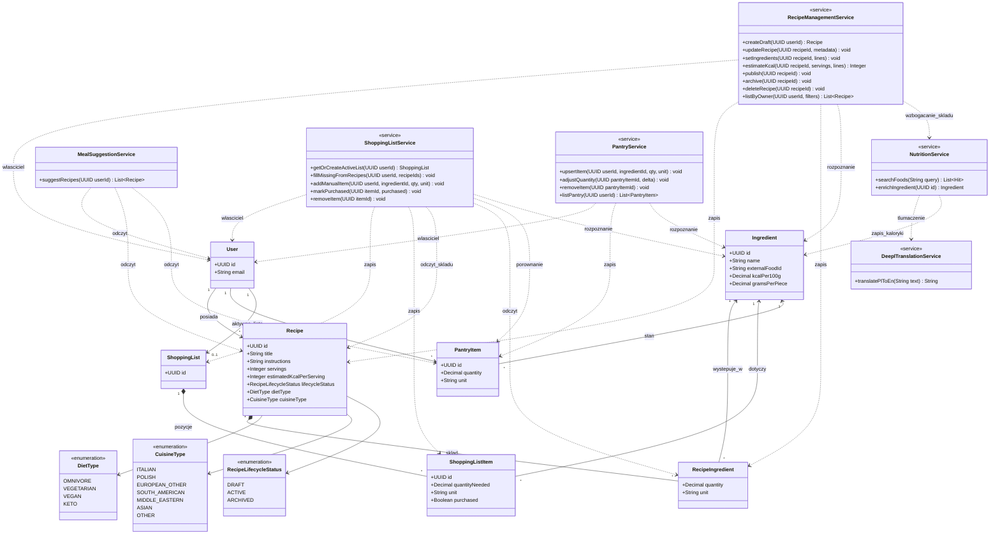
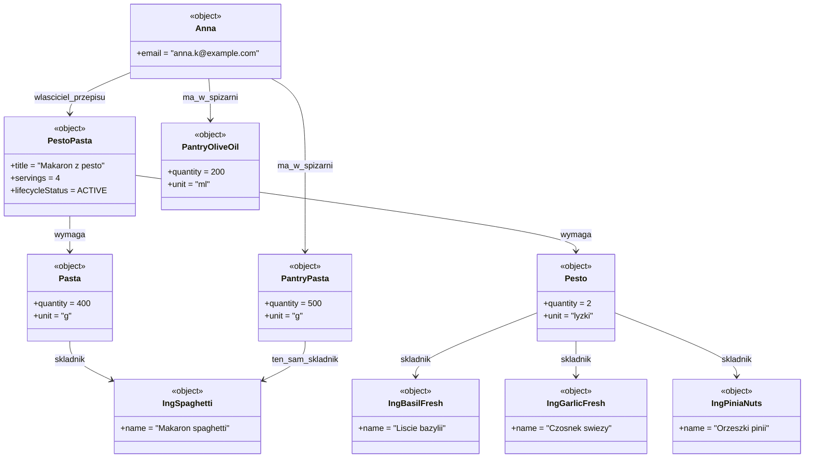
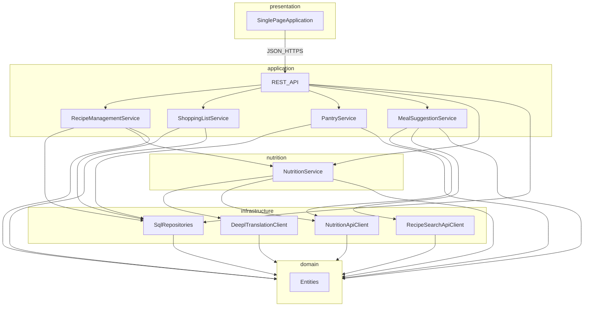
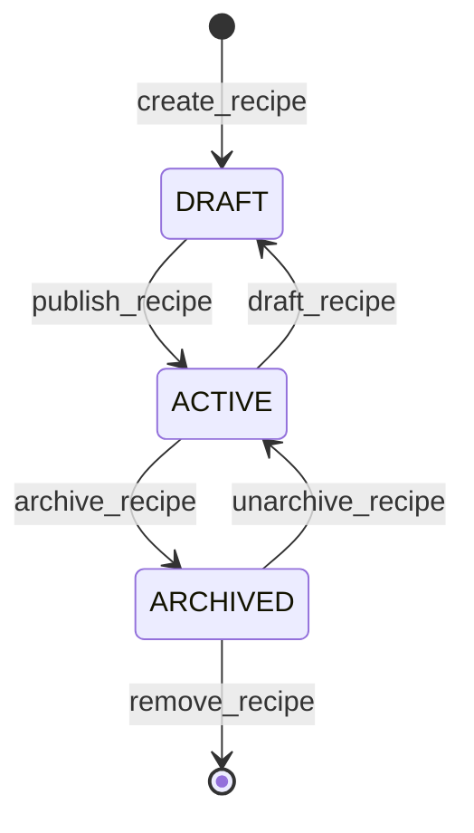
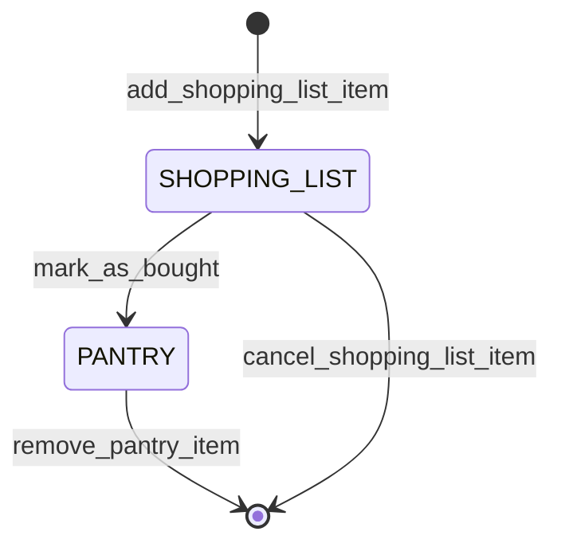

# Model statyczny systemu SmartRecipe

Dokument uzupełnia [model opisowy i diagramy C4](docs.md) o artefakty UML: analizę statyczną, diagram klas, obiektów, pakietów, komponentów oraz wybrane diagramy stanu. Diagramy zostały napisane za pomocą MermaidJS.

---

## Analiza statyczna i powiązanie z modelem opisowym

Model statyczny precyzuje strukturę danych i podział odpowiedzialności między warstwami aplikacji tak, aby realizowały założenia z dokumentacji wstępnej. Poniższa tabela wiąże **fragmenty modelu opisowego** (wymagania słowne) z **elementami modelu statycznego** (klasy, pakiety, komponenty), które pojawiają się na diagramach w kolejnych podrozdziałach.

| Fragment modelu opisowego                                  | Odwzorowanie w modelu statycznym                                                                                                                                 |
| ---------------------------------------------------------- | ---------------------------------------------------------------------------------------------------------------------------------------------------------------- |
| Własne przepisy z listą składników i ilościami             | Klasy `Recipe`, `Ingredient`, `RecipeIngredient` (ilość, jednostka); powiązania jeden do wielu między przepisem a wierszami składowymi                           |
| Filtry: typ kuchni, kaloryczność, rodzaj diety             | Atrybuty / wartości w `Recipe` (np. `servings`, szacowana kaloryczność na porcję, `DietType`, `CuisineType`); reguły filtrowania w warstwie aplikacji            |
| Wirtualna spiżarnia i lista zakupów                        | `PantryItem` (co użytkownik ma w domu), `ShoppingList` oraz `ShoppingListItem` (braki i zakupy)                                                                  |
| Integracja: kalorie składników, wyszukiwarka przepisów     | Pakiet `infrastructure`: `DeeplTranslationClient` (PL→EN nazw składników), `NutritionApiClient` (USDA FDC: kcal/100 g, `gramsPerPiece`), `RecipeSearchApiClient` |
| Tłumaczenie przed wyszukiwaniem USDA                       | `NutritionService` wywołuje DeepL, potem USDA FDC po angielskiej frazie; bez klucza DeepL — fallback na polską nazwę                                             |
| Szacowanie kcal przepisu w szkicu                          | `RecipeManagementService.estimateKcal` — suma składników (g/ml/szt z `gramsPerPiece`) ÷ `servings` → `estimatedKcalPerServing` (tylko `DRAFT`)                   |
| Generowanie propozycji posiłków z posiadanych składników   | `MealSuggestionService` w warstwie `application` — operacja `suggestRecipes` na bazie przepisów użytkownika i stanu spiżarni                                     |
| Dodawanie i edycja własnych przepisów (szkic → publikacja) | `RecipeManagementService` — tworzenie szkicu, skład, metadane, publikacja / archiwizacja / usuwanie; użytkownik operuje przez API, nie bezpośrednio na encjach   |
| Lista zakupów i uzupełnianie jej wg wybranych przepisów    | `ShoppingListService` — aktywna lista, scalanie braków ze składu wielu `Recipe`, odjęcie tego co jest w `PantryItem`, oznaczanie zakupu                          |
| Prowadzenie wirtualnej spiżarni                            | `PantryService` — dodawanie / korekta ilości / usunięcie pozycji spiżarni powiązanych ze `Ingredient`                                                            |

Diagramy C4 (kontekst i kontenery) pokazują **wdrożenie**; niniejszy model statyczny koncentruje się na **logice domenowej, API i integracjach** zgodnie z typową architekturą warstwową. **Encje domenowe** nie są modyfikowane „z UI” wprost — warstwa aplikacji (**serwisy / przypadki użycia**) orkiestruje walidację, trwałość i reguły (np. tylko właściciel może edytować swój przepis).

---

## Diagram klas

**Cel:** przedstawić główne byty domenowe, powiązania liczności oraz **serwisy aplikacyjne**, które realizują przypadki użycia (propozycje posiłków, CRUD przepisów, lista zakupów w tym wypełnianie z przepisów, spiżarnia). Użytkownik korzysta z systemu przez API / UI; **trwała zmiana stanu** przechodzi przez te serwisy. Diagram celowo pomija szczegóły UI i mapowania ORM.

**Ograniczenia:** jeden agregat użytkownika na potrzeby opisu; w rzeczywistej aplikacji warto rozważyć osobny kontekst „konto / preferencje”.

---

## Diagram obiektów (snapshot)

**Cel:** pokazać **konkretną chwilę** w działaniu systemu — instancje i linki, a nie typy. Uzupełnia diagram klas i ułatwia sprawdzenie, czy multiplicities mają sens w przykładowym scenariuszu.

**Ograniczenia:** Mermaid nie ma pełnej notacji UML „obiektowej”; użyto klas ze stereotypem `<<object>>` oraz przykładowych wartości atrybutów.

W tym migawce Anna ma w spiżarni makaron i oliwę w ilościach wystarczających na przepis; brakujące składniki (np. bazylia, czosnek czy orzeszki pinii) mogłyby pojawić się jako obiekty `ShoppingListItem` w rozszerzonej wersji tego samego diagramu.

---

## Diagram pakietów

**Cel:** pokazać **warstwy logiczne** zgodne z kontenerami z C4 (SPA, backend, baza), ale w ujęciu pakietów zależności — bez listy wszystkich klas.

**Ograniczenia:** zależność aplikacji od infrastruktury jest często realizowana przez wstrzykiwanie implementacji repozytoriów; na diagramie zaznaczono to jako użycie infrastruktury przez warstwę aplikacji.

---

## Diagram stanu: cykl życia przepisu

**Cel:** opisać stany `Recipe` istotne dla użytkownika tworzącego własną bazę — od szkicu do archiwum.

Mapowanie na model klas: stan odpowiada atrybutowi `lifecycleStatus` (`DRAFT`, `ACTIVE`, `ARCHIVED`).

---

## Diagram stanu: pozycja na liście zakupów

**Cel:** pokazać, jak **pozycja listy zakupów** przechodzi między stanami od zapotrzebowania do domowej spiżarni (uproszczony model; w implementacji można scalać stany z `PantryItem`).

